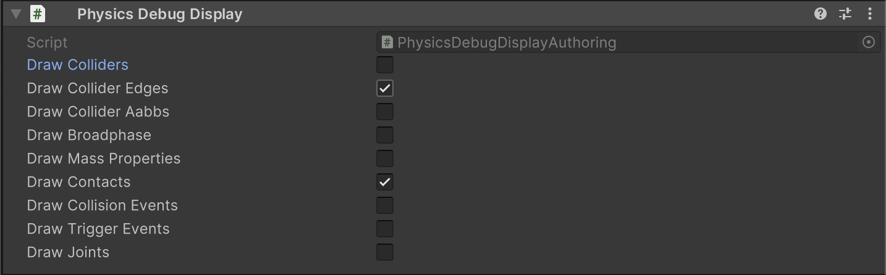

# Physics Debug Display

To visualise Unity Physics, add a `Physics Debug Display` component. As usual, when working with Entities, a **SubScene** is necessary when adding the `Physics Debug Display` component.

| Field                 | Description                                                                                                                                                |
|-----------------------|------------------------------------------------------------------------------------------------------------------------------------------------------------|
| Draw Colliders        | Displays a solid collider around the object.                                                                                                               |
| Draw Collider Edges   | Displays only the edges of the collider.                                                                                                                   |
| Draw Collider AABBs   | Displays the collider's Axis Aligned Bounding Box (AABB), which is usually used in the broadphase.                                                         |
| Draw Broadphase       | Displays the Broadphase expanding the AABB's bodies colliders caused by the collision detection between two bodies. While *Draw Collider AABB's* does not. |
| Draw Mass Properties  | Displays the mass properties.                                                                                                                              |
| Draw Contacts         | Displays a visualization of all contacts.                                                                                                                  |
| Draw Collision Events | Displays a visualization of all collision events.                                                                                                          |
| Draw Trigger Events   | Displays a visualization of all trigger events.                                                                                                            |
| Draw Joints           | Displays a visualization of all Joints, with degrees of freedom, constraints, anchor points and axis alignments.                                           |

 _Physics Debug Display component._
