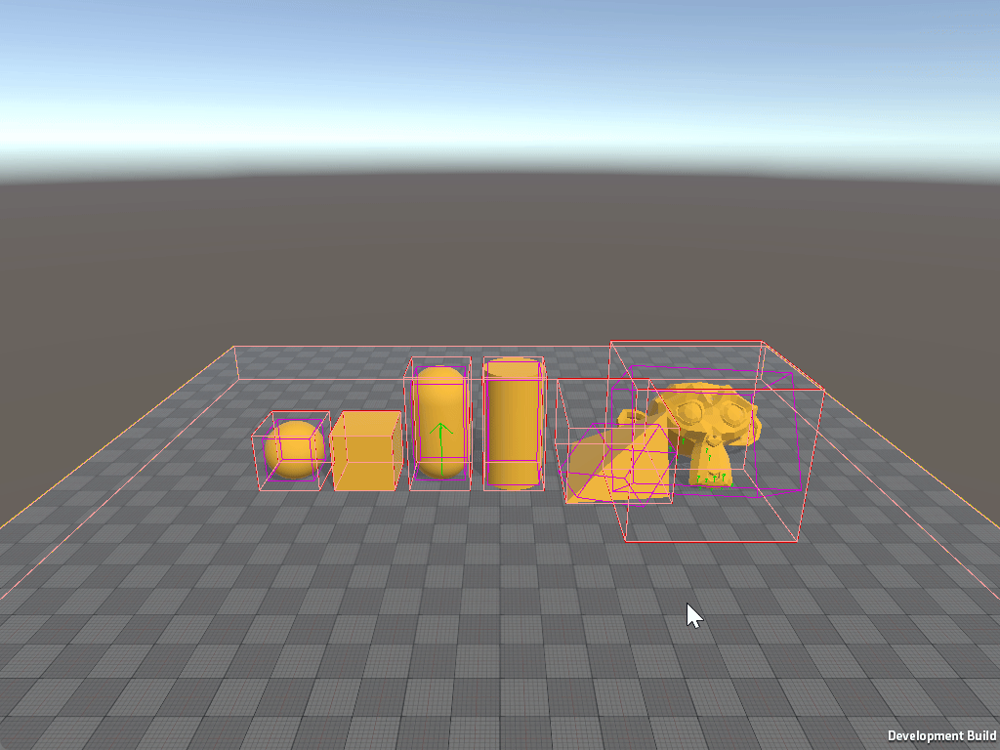

# Physics Debug Display

To visualise Unity Physics, add a `Physics Debug Display` component. As usual, when working with Entities, a **SubScene** is necessary when adding the `Physics Debug Display` component.


| Field                 | Description                                                                                                                                                |
|-----------------------|------------------------------------------------------------------------------------------------------------------------------------------------------------|
| Draw Colliders        | Displays a solid collider around the object.                                                                                                               |
| Draw Collider Edges   | Displays only the edges of the collider.                                                                                                                   |
| Draw Collider AABBs   | Displays the collider's Axis Aligned Bounding Box (AABB), which is usually used in the broadphase.                                                         |
| Draw Broadphase       | Displays the Broadphase expanding the AABB's bodies colliders caused by the collision detection between two bodies. While *Draw Collider AABB's* does not. |
| Draw Mass Properties  | Displays the mass properties.                                                                                                                              |
| Draw Contacts         | Displays a visualization of all contacts.                                                                                                                  |
| Draw Collision Events | Displays a visualization of all collision events.                                                                                                          |
| Draw Trigger Events   | Displays a visualization of all trigger events.                                                                                                            |
| Draw Joints           | Displays a visualization of all Joints, with degrees of freedom, constraints, anchor points and axis alignments.                                           |

<br/>_Physics Debug Display component._


## Physics Debug Display at Runtime

### Enabling Physics Debug Display
To enable the `Physics Debug Display` component in Player builds:

1. Navigate to **Edit > Project Settings > Physics > Unity Physics**.
2. Check **Enable Player Debug Display** project setting, or manually add the `ENABLE_UNITY_PHYSICS_RUNTIME_DEBUG_DISPLAY` scripting define symbol to your Player settings.

### Important Notes

Using `PhysicsDebugDisplayData` will help **debugging** physics behavior directly in-game if required. However, this debugger may impact performance, so avoid using `ENABLE_UNITY_PHYSICS_RUNTIME_DEBUG_DISPLAY` outside of development builds or for debugging purposes only.

### Toggling Parameters at Runtime

The following script demonstrates how to modify `PhysicsDebugDisplayData` at runtime by accessing the component and updating its values as needed. Refer to the [table above](#physics-debug-display) to enable or disable specific debug options.

```csharp
#if ENABLE_UNITY_PHYSICS_RUNTIME_DEBUG_DISPLAY
using Unity.Burst;
using Unity.Entities;
using Unity.Physics.Authoring;
using UnityEngine;

[RequireMatchingQueriesForUpdate]
[UpdateInGroup(typeof(PhysicsDebugDisplayGroup))]
[BurstCompile]
partial struct RuntimePhysicsDebugDisplayDataManager : ISystem
{
    [BurstCompile]
    public void OnCreate(ref SystemState state)
    {
        state.RequireForUpdate<PhysicsDebugDisplayData>();
    }

    [BurstCompile]
    public void OnUpdate(ref SystemState state)
    {
        var debugDisplayData = SystemAPI.GetSingleton<PhysicsDebugDisplayData>();

        if (Input.GetKeyDown(KeyCode.Alpha1))
            debugDisplayData.DrawColliders ^= 1;

        if (Input.GetKeyDown(KeyCode.Alpha2))
            debugDisplayData.DrawColliderEdges ^= 1;

        if (Input.GetKeyDown(KeyCode.Alpha3))
            debugDisplayData.DrawContacts ^= 1;

        // Enable others:
        //debugDisplayData.DrawCollisionEvents ^= 1;
        //debugDisplayData.DrawColliderAabbs ^= 1;
        //debugDisplayData.DrawTriggerEvents ^= 1;
        //debugDisplayData.DrawJoints ^= 1;
        //debugDisplayData.DrawMassProperties ^= 1;
        //debugDisplayData.DrawBroadphase ^= 1;
        //debugDisplayData.ColliderEdgesDisplayMode = (PhysicsDebugDisplayMode)((byte)debugDisplayData.ColliderEdgesDisplayMode ^ 1);
        //debugDisplayData.ColliderAabbDisplayMode = (PhysicsDebugDisplayMode)((byte)debugDisplayData.ColliderAabbDisplayMode ^ 1);
        //debugDisplayData.ColliderDisplayMode = (PhysicsDebugDisplayMode)((byte)debugDisplayData.ColliderDisplayMode ^ 1);

        SystemAPI.SetSingleton(debugDisplayData);
    }
}
#endif
```

