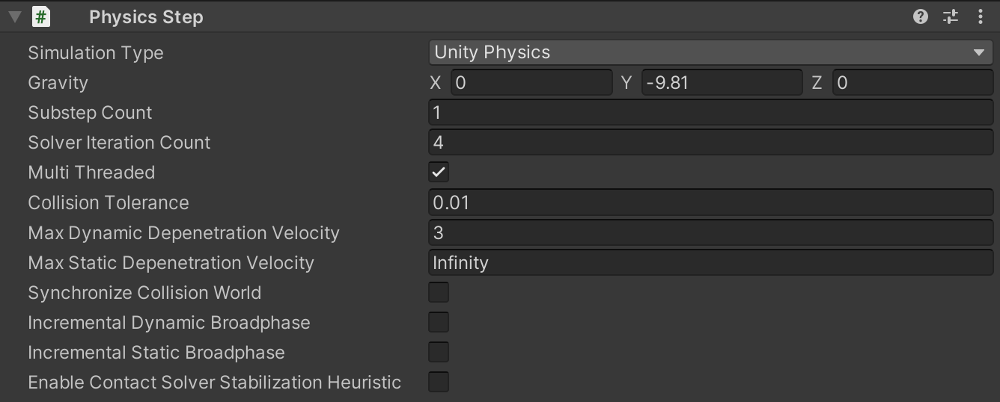

# Physics Step

To control Unity Physics settings, you need a `Physics Step` authoring component. As usual when working with **Entities**, a **SubScene** is necessary when adding the `Physics Step` authoring component. Only one instance of this component should be present in a scene as it will apply to the whole physics simulation.

| Field                                         | Description                                                                                                                                                                                                                                  |
|-----------------------------------------------|----------------------------------------------------------------------------------------------------------------------------------------------------------------------------------------------------------------------------------------------|
| Simulation Type                               | Select between **Unity Physics**, **Havok Physics** or **None**. You can only access the Havok Physics features if you have installed the Havok Physics package and you have a license. If not, Unity Physics is the default physics engine. |
| Gravity                                       | Set the world gravity. You can also use the **Gravity Factor** scalar to set this value, as either a positive or negative float value. The default is 1 (that is, 1 multiplied by WorldGravity).                                             |
| Solver Iteration Count                        | Specify the number of solver iterations the physics system performs. Higher values mean more stability, but worse performance.                                                                                                               |
| Multi Threaded                                | Toggle multi-threading. If enabled, the physics system uses a large number of threads and jobs for simulation. If disabled, the physics system uses a very small number of single threaded jobs.                                             |
| Synchronize Collision World                   | Specify whether to update the collision world after the step for more precise queries.                                                                                                                                                       |
| Enable Contact Solver Stabilization Heuristic | Enabling Contact Solver Stabilization Heuristic results in better object-stacking stability. However, it requires more computational resources when simulating.                                                                              |

 _Physics Step component._
