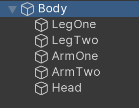

# Compound Colliders

Compound collider shapes allow you to place multiple collider shapes on one physics body. You can arrange the shapes into a hierarchy, and adjust the transform of each shape.

A single GameObject with a built-in **Rigidbody** component or a custom **Physics Body** component can contain multiple child GameObjects that have built-in **Collider** or custom **Physics Shape**. Unity Physics merges these into one compound `PhysicsCollider` for the physics body, where the children have the collider types you specified in the Editor.

This allows you to make complex rigid bodies made of multiple simpler representations, so that the collision detection remains fast and you don't have to settle for a convex hull around the whole object.

In the following example, **Body** is a single **Physics Body** that represents a humanoid torso. The child GameObjects represent one **Physics Shape** each; four Box shapes to represent limbs and a Sphere shape to represent a head. All shapes belong to the parent Physics Body.

 *Compound shape hierarchy*

>[!NOTE]
> You must put all GameObjects (**Body** and its children) in a [sub scene](https://docs.unity3d.com/Packages/com.unity.entities@latest/index.html?subfolder=/manual/conversion-subscenes.html) so that Unity can perform [baking](https://docs.unity3d.com/Packages/com.unity.entities@latest/index.html?subfolder=/manual/baking.html) to convert them into entities and components.

 *The Compound shape in Play mode*
