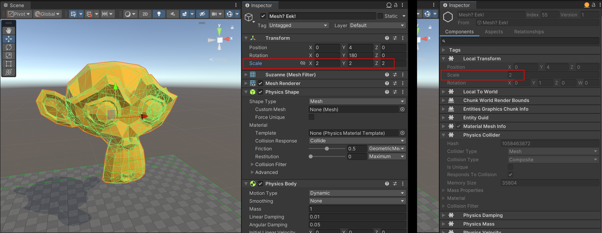

# Physics body data concepts

Unity Physics is based on the [Entity Component System (ECS)](https://docs.unity3d.com/Packages/com.unity.entities@latest). Rigid bodies are represented by component data on the entities within your project. The built-in [`Rigidbody`](xref:Unity.Physics.RigidBody) and [`Collider`](xref:Unity.Physics.Collider) components, and the simplified custom [`Physics Body`](custom-bodies.md) and [`Physics Shape`](custom-shapes.md) component views in the Unity Editor are composed of multiple data components under the hood at runtime. This allows more efficient access and saves space for static bodies which do not require some of the data.

The current set of data components for a rigid body is as follows:

| Component                      | Description                                                                                                                                                                                                                                                                                      |
|--------------------------------|--------------------------------------------------------------------------------------------------------------------------------------------------------------------------------------------------------------------------------------------------------------------------------------------------|
| `PhysicsCollider`              | The shape of the body. Needed for any bodies that can collide.                                                                                                                                                                                                                                   |
| `PhysicsColliderKeyEntityPair` | A buffer element used to associate an original Entity with a collider key in a Compound Collider. Only present when the rigid body contains a compound collider.                                                                                                                                 |
| `PhysicsCustomTags`            | Custom flags applied to the body. They can be used for certain collision event applications. Assumed to be zero if not present, optional component.                                                                                                                                              |
| `PhysicsDamping`               | The amount of damping to apply to the motion of a dynamic body. Assumed to be zero if not present.  Every step, a body with this component will have its velocities scaled down. This could slow down objects, making them more stable, or be used as a cheap approximation of aerodynamic drag. |
| `PhysicsGravityFactor`         | A scalar multiplication factor defining how much a dynamic body should be affected by gravity. This is an optional component, with the factor assumed to be 1 if it is not present. Some objects look more realistic if they appear to fall faster. Other objects (for example, hot air balloons) can rise _up_, which can be emulated with a negative gravity factor. |
| `PhysicsMass`                  | The current mass properties (center of mass and moment of inertia) of a dynamic body. Assumed to be infinite mass if not present.                                                                                                                                                                |
| `PhysicsVelocity`              | The current linear and angular velocities of a dynamic body. Needed for any body that can move.                                                                                                                                                                                                  |
| `PhysicsWorldIndex`            | Shared component required on any Entity that is involved in physics simulation (body or joint). Its Value denotes the index of physics world that the Entity belongs to (0 by default).                                                                                                          |

All physics bodies require components from `Unity.Transforms` in order to represent their position, orientation and scale in world space.

# Dynamic Bodies

Dynamic bodies are bodies that require a `LocalTransform` component and a `PhysicsVelocity` component. Since a dynamic body is unparented during entity baking for improved performance, its `LocalTransform` component can be presumed to be in world space and thus fully defines the body's world space position and orientation. 
During the baking process of a GameObject into a dynamic body, the GameObject's world-space position and orientation is transferred into the `LocalTransform` component of the resultant entity.

# Static Bodies

Static bodies are bodies with a `PhysicsCollider` component, but not a `PhysicsVelocity` component. They require at least one of either the `LocalTransform`, and/or the `LocalToWorld` components. For static bodies without a `Parent`, physics can read their `LocalTransform` values directly, as they are presumed to be in world space.
World space transformations are decomposed from `LocalToWorld` if the body has a `Parent`, using whatever the current value is (which may be based on the results of the transform systems at the end of the previous frame). For best performance and up-to-date results, it is recommended that static bodies do not have a `Parent`.

# Scale and Shear

Any pure, world-space **uniform scale** of the GameObject is transferred into the `LocalTransform` component's `Scale` property. See Figure 1 for an example.
 _Figure 1: An example of how the uniform scale vector (2,2,2) of a GameObject is transferred into the entity's `LocalTransform` component as a `Scale` of 2._

This scale automatically also applies to the collider geometry contained in the entity if present (i.e., within its `PhysicsCollider` component), no matter the geometry type, and to its moment of inertia (defined by its `PhysicsMass` component if present).
As such, dynamic bodies can be uniformly scaled at runtime simply by modifying their `LocalTransform` component's `Scale` property. The resultant change in collider scale is automatically considered during collision detection and resolution, and the change in
mass properties is accounted for in the body's dynamics simulation.

If the GameObject has any **non-uniform scale or shear**, the scale and shear portion of its world-space transformation matrix is transferred into a `PostTransformMatrix` component, added to the resultant entity.
At runtime, this post-transform matrix is automatically applied to the entity's `LocalTransform` matrix, yieldings its final local-to-world matrix. This process ensures that any render mesh associated with the GameObject is correctly scaled and sheared and appears as is expected.

In addition, the same scale and shear is baked into the body's collider geometry if present. This occurs regardless of the collider type, with the caveat that non-uniform scales and shears can not be fully represented in all types of collider geometries. For example, any non-uniform scale can be perfectly applied to a box collider
as long as the scale occurs along the box's principle axes. However, this is not the case for a cylinder, capsule or sphere. On the other hand, any scale and shear can be perfectly applied to mesh-based colliders such as mesh colliders or convex colliders.
In summary, this baking process will attempt to apply the GameObject's edit-time scale and shear to the rigid body's collider geometry as best as possible, but will not be able to fully represent the scale and shear if the collider geometry type does not support it.
After this process, the entity's `LocalTransform.Scale` will be set to `1`, as the full scale and shear has already been applied to the collider geometry.

# Additional Topics

Next in this chapter, the [PhysicsCollider component](physics-collider-components.md) section describes how the shape and geometry of rigid bodies is defined. 

Subsequent chapters describe how to [add rigid bodies to your scenes](authoring.md), and how to [interact with rigid bodies and their runtime data](interacting-with-bodies.md).
