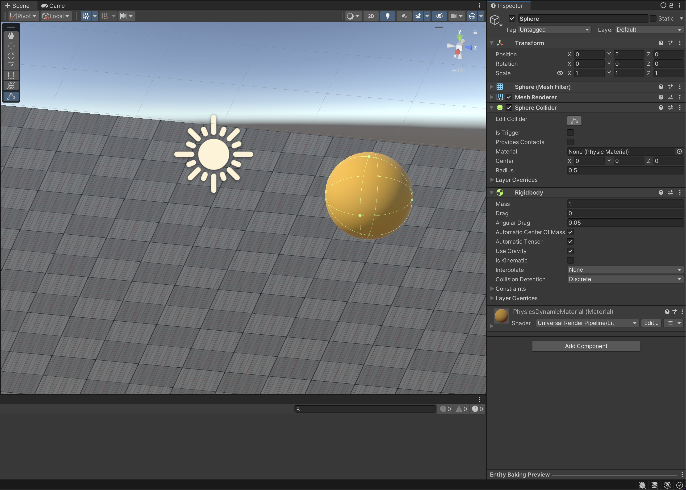
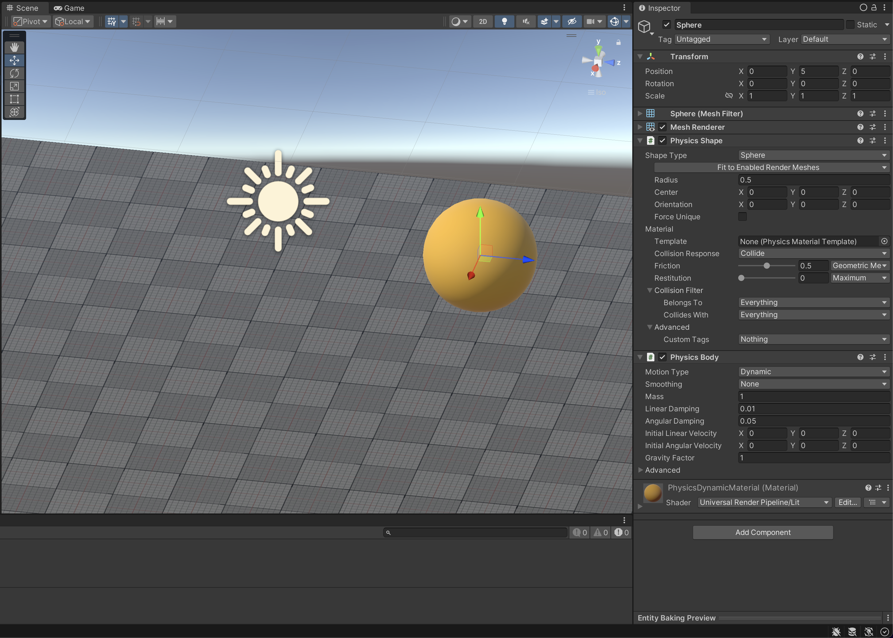

# Simulation setup demonstration

There are two ways you can set up physics simulation in Unity Physics. You can use a combination of Unity Physics and PhysX, or just Unity Physics. This page demonstrates how to create a scene that has both a floor, and an object that falls via gravity and lands on the floor. In both cases, the starting steps to create the floor are the same.

## Using Built-In Physics Authoring components

First, you need a static body to act as a floor so that your dynamic bodies can hit something and not just fall out of the world:
1. Create a new **SubScene** inside the same scene. SubScenes convert Unity GameObjects into Entities.
2. Create a Cube primitive: **GameObject > 3D Object > Cube**.
3. Make the Cube really wide on the X and Z axes – for example: **(20,1,20)**.

Next, create an object that can collide with the floor. Use the first **SubScene** to proceed with the following steps:
1. Create a Sphere primitive GameObject (**GameObject** > **3D Object** > **Sphere**) and place it hovering above the floor.
2. Add a **Rigidbody** component. The GameObject needs to fall under simulated gravity, so make sure the **Use Gravity** property is checked.

> [!NOTE]
> For more information, see the PhysX documentation on [Rigidbody](https://docs.unity3d.com/2023.1/Documentation/Manual/class-Rigidbody.html) and [Collider](https://docs.unity3d.com/2023.1/Documentation/Manual/CollidersOverview.html) components.

Once all of the steps are done, it should look like the following picture:

To simulate, enter Play mode in the Editor. The Sphere should fall and collide with the floor.

For more information refer to the [built-in physics authoring section](built-in-components.md).

## Using Custom Unity Physics Authoring components

First, you need a static body to act as a floor so that your dynamic bodies can hit something and not just fall out of the world:
1. Create a new **SubScene** inside the same scene. SubScenes convert Unity GameObjects into Entities.
2. Create a Cube primitive: **GameObject > 3D Object > Cube**.
3. Make the Cube really wide on the X and Z axes – for example: **(20,1,20)**.
4. Remove the **Box Collider** component. This is the legacy Physics representation, and is not necessary for Unity Physics.
5. Add a **Physics Shape** component. The wireframe outline of the collider should match up with the graphical representation.

Next, create an object that can collide with the floor. Use the first **SubScene** to proceed with the following steps:
1. Create a Sphere primitive GameObject (**GameObject** > **3D Object** > **Sphere**) and place it hovering above the floor.
2. Remove the **Sphere Collider** component.
3. Add a **Physics Shape** component and set its **Shape Type** to **Sphere**.
4. The GameObject needs to fall under simulated gravity, so add a **Physics Body** component to the object.
5. Set the Physics Body's **Motion Type** to **Dynamic**, and ensure that there is a **Mass** value (**1** will do for this example).

Once all of the steps are done, it should look like the following picture:

To simulate, enter Play mode in the Editor. The Sphere should fall and collide with the floor.

For more information refer to the [custom physics authoring section](custom-samples-physics-components.md).

> [!NOTE]
> The pictures above do not show the default render material.
