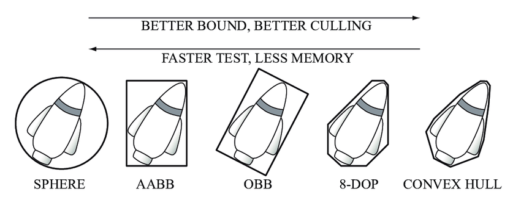

# Order of Physics Simulation

The Unity Physics simulation occurs in the following order:

1. The physics system gets the current state from the components on the body entities. This must happen first, because the simulation is "stateless" (that is, it does not cache anything frame-to-frame).
2. The physics system runs the broadphase. In the broadphase, the simulation takes high-level information about all active bodies in the scene, and checks to see which bounding volumes (axis aligned bounding boxes, or AABBs) are overlapping. This phase quickly tests any potential collisions, and discards any other physics bodies in the scene. 
3. The physics system runs the narrowphase. In the narrowphase, the simulation calculates the exact point of contact for any bounding boxes that should collide, using their respective collider shapes. 
4. Based on those collisions, the physics system calculates a response that takes into account the following parameters:
 * Mass Properties (such as weight and inertia)
 * Friction
 * Restitution (bounciness)
 * Point of collision
5. The physics system solves the collisions, and solves any joints that are restricting the body. This solver stage produces new velocities for the affected bodies.
6. The physics system integrates all dynamic bodies forward in time. To do this, the physics system moves the dynamic bodies according to their linear and angular velocities, while taking the current time step into account
7. Finally, the physics system applies the new transform for the body to the Entity that represents that body.

Unity Physics uses an AABB type of bounding volume for faster memory while still getting a good approximation of body volume. See the figure for how this compares to other methods for determining bounding volume.
 _Types of bounding volumes: sphere, axis-aligned bounding box (AABB), oriented bounding box (OBB), eight-direction discrete orientation polytope (8-DOP), and convex hull. [Reference source](https://www.researchgate.net/figure/Bounding-volumes-sphere-axis-aligned-bounding-box-AABB-oriented-bounding-box_fig9_272093426)._
