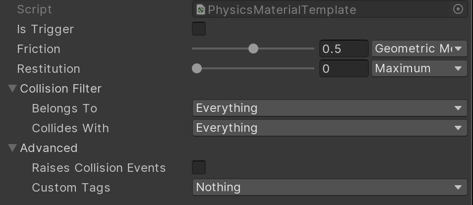

Core components
===============

In the [getting started](getting_started.md) section, you've learned how to setup and configure bodies and shapes. Under the hood, when Unity Physics starts simulating the scene:
1. Several conversion systems (`PhysicsBodyConversionSystem`, `PhysicsShapeConversionSystem` and `PhysicsJointConversionSystem`) read the `PhysicsShapeAuthoring`, `PhysicsBodyAuthoring` and joint scripts (there are several types of joint scripts), convert them to components and add them to your entities.
2. Various physics systems read from these components to generate input to the simulation.

This document describes each of these components, so you can write systems which process these to apply game effects, or even create simulated bodies from code.

# The *PhysicsCollider* component

This is the most important component for the simulation of physics. By adding this component to an entity, you declare that this body will participate in the physics simulation and collision queries (though you also need transform components: `Translation` and `Rotation` for dynamic bodies, `Translation`, `Rotation`, and/or `LocalToWorld` for static bodies). This component decides what the collision geometry "looks" like to the physics simulation. It is analogous to a mesh in a rendering system.

For performance reasons, you should try to avoid using a mesh during physics – use specialized primitive types when possible, which greatly simplifies the process of determining collisions between two Colliders. For example, if a collision geometry can be represented by a sphere, you can write collision tests which only need to consider the sphere center and radius; with a mesh wrapping the same sphere, you would need to consider every triangle in the mesh.

The most important property of a `PhysicsCollider` is a `BlobAssetReference` to the Collider data used by the physics simulation (which is in a format optimized for collision queries). Each of the Collider types implement an `ICollider` interface, and for each Collider type, there is a static `Create()` function, which takes parameters specific to the shape. For example, a `SphereCollider` is built from a position and a radius, while a `ConvexCollider` is built from a point cloud.

>**Note:** It is possible to create a Collider which has a null `BlobAssetReference`. Unity Physics still simulates the body, but it cannot collide with anything. This can be useful in some particular scenarios – for example you can connect such a body to another body using a joint, and feed the simulated positions into your skinning system.

## Collider Materials

The Collider also stores a Material, which describes how it reacts when in collision with other objects.

The [restitution](https://en.wikipedia.org/wiki/Coefficient_of_restitution) of a Material determines how "bouncy" the Material is. The higher the restitution, the more velocity is preserved when the object collides with another. A value of zero indicates that the object should not bounce at all, while a value of one indicates that all the speed of the object should be preserved.

>**Note:** Due to numerical imprecision and approximations inside the physics simulation, a body with a restitution of **1** will eventually come to rest.

The [coefficient of friction](https://en.wikipedia.org/wiki/Friction) of a body relates how "sticky" an object is when another object is sliding along its surface. This is the ratio between the force pushing down on the surface and the force pushing against the relative velocities between the bodies. A value of zero means that friction would not slow down the body, while higher values indicate that more energy should be lost.

Both friction and restitution have a `CombinePolicy` property which determines how the engine should merge two different values. For example, you may want to always use the largest or smallest value in a collision.

In addition to these, a Material also has a set of flags, which enable special behaviors during the physics simulation. The most important are represented by the `CollisionResponsePolicy`:

* `Collide`: regular collider.
* `RaiseTriggerEvents`: if this flag is enabled, the Collider is treated as a "detector" rather than as a physical body. This means it cannot receive forces from a collision, instead, it will raise an event to signify that an overlap occurred. For example, you can use this to determine when your player enters a specific region.
* `CollideRaiseCollisionEvents`: this is similar to the previous flag, but still allows the body to push other bodies normally. The events that the simulation raises can then be used to determine how objects are colliding. This would, for example, allow you to play sound events.
* `None`: collider moves and intercepts queries, but generates no collision response and no events.

A Material template asset can be created in the **Create > DOTS > Physics > Physics Material Template** menu, in the project window.

## The Collision filter

Each Collider also has a `CollisionFilter` which allows you to control what objects are permitted to collide with each other. The properties on this object allow you to categorize objects in relation to what types they collide with. For example, you might want to mark certain Colliders as "transparent" so that when performing a raycast test to determine if two characters can see each other, they are able to "see through" Colliders which have the transparent bit set.

The default values for collision filter ensure that every object collides with every other object. By configuring the filter in particular ways, you are able to opt-out of select collisions, depending on what you want from gamecode.

# Dynamic bodies

By itself, a world containing entities with `PhysicsCollider` components won't actually _do_ anything. This is because the bodies you declare are all treated as static – they cannot move, and from the perspective of collision, they have infinite mass. In order to make our simulations more interesting, you need to add the ability for body transforms to change.

Adding a `PhysicsVelocity` component makes the physics simulation aware that the Collider can have some linear and angular speed and that the Collider should move. You can change the values of this component yourself if you wish to control how a Collider is moving, but during the physics simulation, Unity Physics also computes a new value for velocity (from gravity and forces from contacts/joints) and updates the component.

# Mass

Suppose you have a scene with two physics Colliders, one of which has a velocity pointing towards the static Collider. When you enter Play mode, the moving Collider moves right through the static one. You haven't changed the collision filter, or made one a trigger, so what happened? This is a case of an unstoppable force meeting an immovable object. As explained before, the Collider without a velocity cannot move. When the two collide, you would expect forces to be applied between them.

The problem is that, even though one Collider is moving, the simulation does not know how _heavy_ it is, so does not know how it would respond to collisions. In this case, Unity Physics treats the moving Collider as if it had an _infinite_ mass, so it will just push every object out of the way.

This kind of behaviour is useful in some scenarios. Suppose you had an elevator object in-game. It makes sense that it should follow your desired path _exactly_ – it should move no matter how many characters are in the lift and it should not get stuck on "snags" inside a bumpy elevator shaft. This behaviour is sometimes called "kinematic" or "keyframed" in other physics simulations.

To inform the simulation of masses, you can use the `PhysicsMass` component. This tells Unity Physics how a Collider reacts to an impulse. It stores the mass and [inertia tensor](https://en.wikipedia.org/wiki/Moment_of_inertia) for that entity as well as a transform describing the orientation of the inertia tensor and center of mass.

>**Note:** Some of these values are stored as inverses, which speeds up many of the internal physics calculations. It also allows you to specify infinite values, by setting the relevant component to zero.

While you can provide these values yourself, it is not necessary in many cases; the `ICollider` for a Collider interface has a `MassProperties` property, where appropriate values are calculated for you automatically. You might find it more useful to use the calculated `MassProperties` property as a starting point, and then scale them – for example, by multiplying the mass by ten for an extra-heavy gameplay object.

# Other components

Some additional components allow you to change the simulation behavior:

| Component   | Description |
| ----------- | ----------- |
| `PhysicsStep` | Allows you to override the default simulation parameters for the whole scene, for example, by changing the direction of gravity or increasing the solver iteration count, making it more rigid (at the cost of performance). |
| `PhysicsDamping` | Allows you to add a per-Collider "slow-down" factor. Every step, a Collider with this component will have its velocities scaled down. This could slow down objects, making them more stable, or be used as a cheap approximation of aerodynamic drag. |
| `PhysicsGravityFactor` | Allows you to scale the amount of gravity applied to an individual Collider. Some objects look more realistic if they appear to fall faster. Other objects (for example, hot air balloons) appear to fall _up_, which can be emulated with a negative gravity factor. |

# Joints

A `PhysicsJoint` component is a little different from the others described here. It _links_ two entities together with some sort of constraint, for example, a door hinge. These entities should have `PhysicsCollider` components, and at least one of them should have a `PhysicsVelocity` component – otherwise the joint would have no effect. During the physics step, Unity Physics solves the joint as well as the contacts that affect each entity.

The behavior of the joint is described by the `JointData` property. Like the `PhysicsCollider` component, this is a `BlobAssetReference` to a `JointData`. The precise behavior of each joint depends on the type of this data.

Unity Physics has currently several pre-created types of joints – and the list will extend in the near future. For the current existing joint types, there are static creation functions in `Unity.Physics.JointData` and, like with shapes, the input parameters vary between different types. For example, the `CreateBallAndSocket` method simply needs to know where the joint is located relative to each body, while `CreateLimitedHinge()` additionally needs to know what axis the bodies are permitted to rotate about, and what the minimum and maximum limit for this rotation is.

Here are the currently available Joint types:

| Joint               | Description |
| ------------------- | -- |
| **Ball and Socket** | Allows motion around an indefinite number of axes. Humans have such joints in the hips and shoulders. |
| **Limited Hinge**   | Allows limited articulation on one axis. Humans have such joints in the fingers and knees. |
| **Fixed**           | Constrains two rigid bodies together, removing their ability to act independent of each other. |
| **Hinge**           | Allows free rotation on one axis. Can be used for spinning wheels and carousels. |
| **Prismatic**       | Constrains two bodies to a sliding motion on one axis. Can be used to make various sliding doors. |
| **Ragdoll**         | Limits the motion on a few axes. Useful for creating characters. |
| **Stiff Spring**    | Constrains two bodies to be a certain distance apart from each other. |

In addition to specifying the joint data and the entities, an important setting is `EnableCollision` – this defaults to _off_, which is the recommended setting. If you have two bodies constrained together (such as a door attached to a car) it is very likely that they overlap each other to some degree. When this happens, you can imagine that the joint pulls the objects together, while the collision detection is pushing them apart. This leads to "fighting" between the joint and collision, resulting in unstable simulation or too many events being raised. When `EnableCollision` is _off_, the physics simulation will not perform collision detection between the two bodies, even if the Collider's collision filter would normally say they should collide.

>**Note:** If you have multiple joints between a pair of bodies, collisions will be enabled if _any_ of the joints have requested collision.
