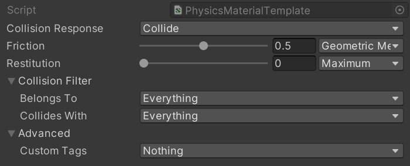

# Custom Physics Materials

Materials are a set of properties that affect how a Physics Body reacts when it encounters another Physics Body. The material properties in Unity Physics include **Friction**, **Restitution** (bounciness), and what the object collides with. Material properties can be saved to a **Physics Material Template** asset, or set directly in the **Physics Shape** for an object.

The [restitution](https://en.wikipedia.org/wiki/Coefficient_of_restitution) of a Material determines how "bouncy" the Material is. The higher the restitution, the more velocity is preserved when the object collides with another. A value of zero indicates that the object should not bounce at all, while a value of one indicates that all the speed of the object should be preserved.

>[!NOTE]
> Due to numerical imprecision and approximations inside the physics simulation, a body with a restitution of **1** will eventually come to rest.

The [coefficient of friction](https://en.wikipedia.org/wiki/Friction) of a body relates how "sticky" an object is when another object is sliding along its surface. This is the ratio between the force pushing down on the surface and the force pushing against the relative velocities between the bodies. A value of zero means that friction would not slow down the body, while higher values indicate that more energy should be lost.

Both friction and restitution have a `CombinePolicy` property which determines how the engine should merge two different values. For example, you may want to always use the largest or smallest value in a collision.

In addition to these, a Material also has a set of flags, which enable special behaviors during the physics simulation. The most important are represented by the `CollisionResponsePolicy`:

* `Collide`: regular collider.
* `RaiseTriggerEvents`: if this flag is enabled, the Collider is treated as a "detector" rather than as a physical body. This means it cannot receive forces from a collision, instead, it will raise an event to signify that an overlap occurred. For example, you can use this to determine when your player enters a specific region.
* `CollideRaiseCollisionEvents`: this is similar to the previous flag, but still allows the body to push other bodies normally. The events that the simulation raises can then be used to determine how objects are colliding. This would, for example, allow you to play sound events.
* `None`: collider moves and intercepts queries, but generates no collision response and no events.

A Material template asset can be created in the **Create > Physics > Physics Material Template** menu, in the project window.

The following table describes the fields in the **PhysicsMaterialTemplate** asset:

| Field              | Description                                                                                                                                                                                                                                                                                           |
|--------------------|-------------------------------------------------------------------------------------------------------------------------------------------------------------------------------------------------------------------------------------------------------------------------------------------------------|
| Collision Response | Collide: results in collision without raising any event.  Collide Raise Collision Events: results in collision and raises events when contact is made.  Raise Trigger Events: results in no collision but triggers events.  None: results in no collision with no events being triggered. |
| Friction           | Range bar modifies the friction value when physics bodies slide down onto a tilded surface.                                                                                                                                                                                                           |
| Restitution        | Range bar modifies the restitution also known as bounciness of physics bodies when they collide each other.                                                                                                                                                                                           |
| Collision Filter   | Needed for triggering action either in Collide, Collide Raise Collision Events or Raise Trigger Events.                                                                                                                                                                                               |
| Custom Tags        | Select or add new Custom Physics Material Names.                                                                                                                                                                                                                                                      |

 _Example of the **PhysicsMaterialTemplate** asset._

## Custom material example

Try the following settings with the example scene described in [Simulation setup demonstration](concepts-simulation-set-up.md).
1. Select the Sphere. In the **Physics Shape** component's **Material** section, set the **Restitution** to **1**. When you enter play mode, the sphere should now bounce back from collision to nearly where it began.
2. In the **Physics Body** component, change the **Linear Damping** to 0. The sphere should now get even closer to its starting point.
3. Rotate the floor so that it is tilted, to allow the Sphere to roll, then select the Sphere and go to **Physics Shape** > **Material**. Adjust the **Friction** setting and experiment with the change in movement. The higher the **Friction** value is, the more the sphere catches and rolls on the surface, rather than just sliding.
4. Select the Sphere and go to **Physics Shape** > **Material**. Experiment the with the **Restitution** value. The higher the **Restitution**, the more the sphere bounces on contact.
