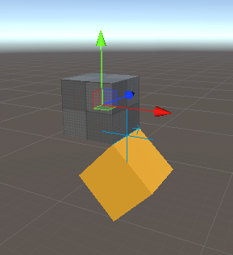
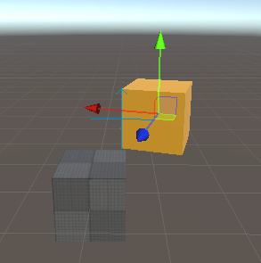
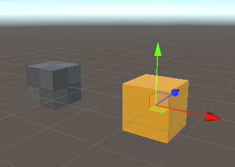

# Motor Authoring in Unity Physics

A motor is a type of `PhysicsJoint` that has one driven constraint. There are two types of motor: angular motors and linear motors. Each of these motor types can either drive towards a position or towards a velocity. This leads to the four possible motor permutations that are supported:

| Motor                   | Description                                                                                                                                                           |
|-------------------------|-----------------------------------------------------------------------------------------------------------------------------------------------------------------------|
| Rotation Motor          | An angular motor, drives towards a position/orientation. A motorized hinge joint that rotates about an axis toward the specified target angle                         |
| Angular Velocity Motor  | An angular motor, drives towards a velocity. A motorized hinge joint that rotates about an axis at the specified constant target velocity                             |
| Position Motor          | A linear motor, drives towards a position. A motorized prismatic joint that drives toward the specified relative target position. The axis is the direction of motion |
| Linear Velocity Motor   | A linear motor, drives towards a velocity. A motorized prismatic joint that drives to a constant target relative velocity. The axis is the direction of motion        |

In general, there are three possible ways to author a motor:
1. Use a GameObject Joint Component and use the baking pipeline to bake the data into Unity Physics 
2. Use a C# API to author the motor 
3. Use a Unity Physics authoring motor component for the motor type (note that the motor authoring components in the Unity Physics Samples are not guaranteed to be supported, therefore this method is not recommended)


## The Rotational Motor
A rotational motor is an angular motor type that will rotate about an axis towards a specified target angle. A good example is a swinging door that is designed such that the door closes on its own if opened from either direction. The motor component should be placed on the body that requires this motor behaviour. Generally, these parameters need to be specified:
- Pivot Position: the position that the body rotates around. It is relative to the body that the motor is placed on (is in local space) and is offset from the center of this body.
- Axis of Rotation: the axis about which to rotate around the pivot point. This value must be normalized.
- Target Angle: the angle from the `Connected Body` to the Body with the motor component. Units are dependant on the authoring method. The direction of rotation follows the left-hand rule for rotation.

For each of the Rotation Motor Authoring sections, we will create the following configuration: a static cube with a dynamic child, offset by 1, under it. This child cube will have a rotational motor targeting +45 degrees, with a rotation axis along the z-axis and a pivot defined by (0.5, 0.5, 0), relative to the center of the child cube. See the figure, General Rotation Motor Example 1, for how this should look during simulation. Expected behaviour for this setup: The 'StaticCube' will remain stationary. The 'RotationMotor' GameObject will hinge along the z-axis, at the pivot (0.5, 0.5, 0) and rotate around this pivot. It will rotate 45 degrees away from the bottom edge of the static cube and hold position there.

<br/>_General Rotation Motor Example 1: A rotation motor that rotates about the z-axis with a target rotation of +45 degrees._

### Authoring via GameObject Component
There are two potential methods to create a rotation motor using a GameObject Component: using a `Hinge Joint` or using a `Configurable Joint`. We will outline the steps to create each. Note that not all parameters within a GameObject component are used by Unity Physics.

#### Method 1) Using a `Hinge Joint` Component:
1. Starting from a SubScene, add a GameObject > Cube. Rename it 'StaticCube'. A BoxCollider should already be present as a component. 
2. Add a `Rigidbody` component to 'StaticCube' and then disable `Use Gravity` and enable `Is Kinematic`. 
3. Create another Cube and parent it from 'StaticCube'. Name this one 'RotationMotor'. Add a `Rigidbody`. Set the Transform Position to (0,-1,0)
4. Add a `Hinge Joint` component to the 'RotationalMotor' GameObject 
5. To set up the General Rotation Motor Example 1 with a pivot at (0.5, 0.5, 0) and rotation along the z-axis, set the following:
   - `Connected Body` = 'StaticCube'. Motor rotation will be relative to this body.
   - `Anchor` = (0.5, 0.5, 0). This is the pivot position of the motor. It is relative to the centre of 'RotationMotor'. This data is baked into the `BodyFrame` position of bodyA.
   - `Axis` = (0, 0, 1). The axis that the pivot will rotate about. This data is baked into the `BodyFrame` axis of bodyA.
   - `Auto Configure Connected Anchor` = True. This is always baked as if True. The `BodyFrame` of bodyB (the `Connected Body`) will be automatically calculated from the `Axis` and `Anchor` of bodyA. If it is not enabled, the baking pipeline will calculate the `BodyFrame` for the `Connected Body` as if it were enabled. This setting takes the `Anchor` and `Axis` and calculates the position of the `Connected Body` relative to the body with the motor on it. If a design requires this to be false then the motor API method must be used (see section on Authoring via the C# API).
   - `Use Spring` = True. This enables the position-based motor. This data is not baked directly, but is used to determine that this Hinge Joint should be a motor.
   - `Spring` > `Target Position` = 45. The target that the motor should drive for relative to its starting position. In degrees. The rotation direction follows the Left-Hand Rule for rotations.
   - `Break Torque` = 1000 (Value arbitrarily set in this example). This is the maximum impulse that the motor constraint will be able to exert. Within the code, this is multiplied by 'fixedDeltaTime' to get an impulse. This data is baked into `maxImpulseOfMotor`. If set to Infinity (the default), then this motor is capable of exerting any force needed to reach the target. It is also baked into `MaxImpulse` for non-motorized angular constraints.
   - `Break Force`: This value will be baked into the MaxImpulse data to enable breakable events. This data is baked into `MaxImpulse` and applies to non-motorized linear constraints.

No other data is used by the baking pipeline at this time to create a Rotation Motor. In particular, note that in the `Spring` section of the `Hinge Joint` component, that neither `Spring` or `Damping` parameters are baked into the Entities data. The default values of the Unity Physics engine are used instead.

#### Method 2) Using a `Configurable Joint` Component:

While using this method is possible, it is recommended to use the `Hinge Joint` instead. 

The General Rotation Motor Example 1 creates a z-axis rotating motor that will hold at a +45 degree angle, however, this design is more complex when authoring using a `Configurable Joint` component. 

The design is complicated by two items. The first item is due to the design of the `Configurable Joint` for use with GameObject and the second item is due to a simulation requirement of the physics solver. When setting the `Target Rotation` for a `Configurable Joint`, the target is set such that the current location is an offset from the target. This change of reference frame means that to rotate as in the example, by +45 degrees, the `Target Rotation` should be set to -45 degrees. This relates to the first item, when setting a negative `Target Rotation` in the Inspector, the field will automatically recalculate the value to be positive. For example, if you enter -45 degrees, it will be updated to 315 degrees. This leads into the second item regarding simulation requirements. The Rotation Motor is only stable for rotations within the -180 to +180 degree range. The Inspector updating a -45 degree target to +315 degrees will lead to the creation of an unstable motor.

The General Rotation Motor Example is modified in the steps below to get around the complexity mentioned in the previous paragraph by changing the direction of the `Axis`. The overall behavior of the motor remains the same:
1. Repeat Steps 1-3 from Method 1 
2. Add a `Configurable Joint` to the 'RotationalMotor' GameObject 
3. To set up the General Rotation Motor Example 1 with a pivot at (0.5, 0.5, 0) and rotation along the z-axis, set the following:
   - `Connected Body` = 'StaticCube' Motor rotation will be relative to this body.
   - `Anchor` = (0.5, 0.5, 0).  This is the pivot position of the motor. It is relative to the centre of 'RotationMotor'. This data is baked into the `BodyFrame` position of bodyA.
   - `Axis` = (0, 0, -1). The axis that the pivot will rotate about. This data is baked into the `BodyFrame` axis of bodyA.
   - `Auto Configure Connected Anchor` = True. This is always baked as if True. The `BodyFrame` of bodyB (the `Connected Body`) will be automatically calculated from the `Axis` and `Anchor` of bodyA. If it is not enabled, the baking pipeline will calculate the `BodyFrame` for the `Connected Body` as if it were enabled. This setting takes the Anchor and Axis and calculates the position of the Connected Body relative to the body with the motor on it. If a design requires this to be false then the motor API method must be used  (see section on Authoring via the C# API).
   - `Secondary Axis` = (0, 1, 0). This could also be (1, 0, 0), but it does need to be perpendicular to `Axis` (A check is done internally to verify this). This data is used by the baking pipeline to set up `BodyFrame` data.
   - `X / Y / Z Motion` = Locked. For an angular motor, these must be locked. Required by the baking pipeline.
   - `Angular X Motion` = Free. The baking pipeline currently requires this to be Free. (Applies to the primary `Axis` field).
   - `Angular Y Motion` = Locked. The baking pipeline currently requires this to be Locked. (Applies to the `Secondary Axis` field).
   - `Angular Z Motion` = Locked. The baking pipeline currently requires this to be Locked. (Applies to the axis perpendicular to both `Axis` and `Secondary Axis` field).
   - `Angular X Drive`:
     - `Position Spring` = 10000. While not directly used by the baking, it is used to determine if a `Configurable Joint` is a rotation motor. For it to be identified as such, it needs to be non-zero.
     - `Position Damper`: is not used to bake a `Rotation Motor`
     - `Maximum Force` = 3.402823e+38. This is the maximum impulse that the motor constraint will be able to exert. Within the code, this is multiplied by 'fixedDeltaTime' to get an impulse. This would set the equivalent of `Break Torque` for a `Hinge Joint`. This data is baked into `MaxImpulseOfMotor`. 
   - `Target Rotation` = (45, 0, 0). The target rotation in degrees, relative to the target rotation. Note that the x,y,z components of this field align with the setting of `Axis` and `Secondary Axis`, not x,y,z in world space. Since drives along the primary `Axis` are only supported, only the x-component of this field is baked into `Target`.
   - `Break Force` = Infinity. This value is multiplied by 'fixedDeltaTime' to get an impulse. It is baked into 'MaxImpulse' for breakable events and applies only to linear non-motorized constraints.
   - `Break Torque` = Infinity. This value is multiplied by 'fixedDeltaTime' to get an impulse. It is baked into 'MaxImpulse' for breakable events and applies only to angular non-motorized constraints.

**Important!** Due to the complexity of the `Configurable Joint`component, the baking pipeline is only supporting a simplified use-case when authoring a rotational motor. It is only possible to apply a drive to the primary `Axis`. When selecting the DOF options, `X/Y/Z Motion` must each be set to Locked, `Angular Y/Z Motion` must be set to Locked and `Angular X Motion` must be set to Free. 

Any other settings will result in an error message in the Console and the `Configurable Joint` baking will fail. The baking will not proceed until all errors have been resolved. To change the rotation direction of the motor, the `Axis` field must be used. Any drive settings in the Inspector that were not listed in the step-by-step instructions will not be baked. The `Target Rotation` field will only use the x-component data. If a joint is driven on either the secondary or tertiary axis, then it is advised to add another component to create that drive separately. Note that depending on the configuration, this may lead to unstable simulation.

### Authoring via the C# API
The C# API to author a Rotation Motor is
```csharp
PhysicsJoint.CreateRotationalMotor(
    bodyAFromJoint, 
    bodyBFromJoint, 
    target, 
    maxImpulseOfMotor)
```
where:
- `bodyAFromJoint`: A `BodyFrame` that specifies the pivot point and axis of rotation in the space of body A
- `bodyBFromJoint`: A `BodyFrame` that specifies the pivot point and axis of alignment in the space of body B (the Connected Body).
- `target`: The magnitude of the target in radians. It is relative to the current orientation.
- `maxImpulseOfMotor`: The magnitude of the max impulse that a motor constraint can exert in a single step. If adjusting this parameter, a trial and error approach may be needed to get the desired behaviour.

When authoring via Component, it is required to set `Auto Configure Connected Anchor` = True, however, if a design requires this to be false then it is possible to use this API method instead. Particular care should be taken to ensure that `bodyBFromJoint` is set correctly. However, disconnecting bodyA and bodyB in this way is unsupported for this version.

To author the General Rotation Motor Example 1, use the following settings:
- `bodyAFromJoint`:
  - `Axis` = (0,0,1)
  - `PerpendicularAxis` = (-1,0,0)
  - `Position` = (0.5, 0.5, 0)
- `bodyBFromJoint`:
  - `Axis` = (0,0,1)
  - `PerpendicularAxis` = (-1,0,0)
  - `Position` = (0.5, -0.5, 0)
- `target` = 0.7853982
- `maxImpulseOfMotor`: Infinity

See the C# API Documentation for more details.

**Important!** All axes within the `BodyFrame` parameters must be normalized.

### Authoring via the Rotational Motor Authoring Component in Physics Samples
The Rotational Motor component exists only in the Unity Physics Samples Project and is intended for educational/internal testing purposes. To use this component, the script must be available locally. It can be found in the Unity Physics Samples Project at this path: `Assets/Common/Scripts/Creators/Motors/RotationalMotor.cs`. Arguments for this component may change, or the component may be deprecated in the future. See the Joints/Motors Demos in the Unity Physics Samples for sample usage.

To set up the General Rotation Motor Example 1, follow these steps:
1. Starting from a SubScene, add a GameObject > Cube. Rename it 'StaticCube'. A BoxCollider should already be present as a component. Remove the Box Collider. 
2. Add a `Physics Body` Component to 'StaticCube' (a `Physics Body` is the ECS custom component similar to a `Rigidbody`). Set `Motion Type` to Static. 
3. Add a `Physics Shape` Component to 'StaticCube' (a `Physics Shape` is the ECS custom component similar to a `Box Collider`). Don't modify the default settings. 
4. Create another Cube and parent it from 'StaticCube'. Name this one 'RotationMotor'. Add a `Physics Body`; no settings need to be modified. Set the Transform Position to (0,-1,0).
5. Add the `Rotational Motor` component to the 'RotationalMotor' GameObject. (The script needs to be available locally) 
6. To set up the General Rotation Motor Example 1 with a pivot at (0.5, 0.5, 0) and rotation along the z-axis, set the following:
  - `Connected Body` = 'StaticCube'. Motor rotation will be relative to this body.
  - `Enable Collision`. If enabled, then this body may collide with the `Connected Body`.
  - `Max Impulse`. If not equal to infinity, then breakable events can be raised: If the impulse per axis exceeds this threshold, then the constraint will break. See documentation on Breakable Events for more info. This applies only to angular and linear non-motorized constraints.
  - `Pivot Position` = (0.5, 0.5, 0). This is the pivot position of the motor. It is relative to the centre of 'RotationMotor'. This data is baked into the `BodyFrame` position of bodyA.
  - `Axis of Rotation` = (0, 0, 1). The axis that the pivot will rotate about. This data is baked into the `BodyFrame` axis of bodyA.
  - `Target Angle` = 45. The target that the motor should drive for is relative to its starting orientation. In degrees. The rotation direction follows the Left-Hand Rule.
  - `Max Impulse Applied by Motor` = Infinity. This is the maximum impulse that can be exerted by the motor. This applies only to motorized constraints. Since this maximum cannot be exceeded, a motorized constraint cannot break.

All data in the `Rotational Motor` component is baked.

### Rotation Motor Authoring Tips
- Setting the `Target`>= 180 degrees may result in unstable simulation and is not recommended. If a `Target`>180 is required, remember that changing the sign of the `Axis` will change the direction of rotation and will get to the same final target position.
- Remember that Unity follows the left-hand rule for rotations. The thumb points in the direction of the rotation axis and fingers will curl in the direction of positive rotation.
- Do not stack different motors inside one GameObject component since the baking pipeline may not recognize the setting. For example, if making a motorized Hinge Joint, do not enable both `Use Spring` and `Use Motor`. If you want to create multiple motors on one GameObject, you will need to add a new component for each. Note that stacking joints/motors may lead to constraints fighting each other during solve and yield unstable simulation.
- If no `Connected Body` is specified, then the motor will behave as if it is connected to the world. This is equivalent to a static rigid body at the origin with default orientation.
- When setting the `MaxImpulseOfMotor` an iterative/trial-and-error approach is best to get the desired behavior.
- If authoring using a `Hinge Joint` then ensure that the `Use Motor` parameter is false when authoring a rotational motor.


## The Angular Velocity Motor
An angular velocity motor is an angular motor type that will rotate about an axis at a specified target velocity. A good example is how a wheel on a car spins at a constant velocity when you press on the gas pedal with constant force. The motor component should be placed on the body that requires this motor behaviour. Generally, these parameters need to be specified:
- Pivot Position: the position that the body rotates around. It is relative to the body that the motor is placed on (is in local space) and is offset from the center of this body.
- Axis of Rotation: the axis about which to rotate around the pivot point. This value must be normalized.
- Target Velocity: the velocity to be targeted. Units are dependant on the authoring method. The direction of rotation follows the left-hand rule for rotation.

For each of the Angular Velocity Motor Authoring sections, we will create the following configuration: a static cube with a dynamic child, offset by 1, above it. This child cube will have an angular velocity motor targeting 90 degrees/s, with a rotation axis along the y-axis and a pivot defined by (0.5, 0, 0.5), relative to the center of the child cube. See the figure, General Angular Velocity Motor Example 1, for how this should look during simulation. Expected behaviour for this setup: The 'StaticCube' will remain stationary. The 'AngularVelocityMotor' GameObject will hinge along the y-axis, at the pivot (0.5, 0, 0.5) and will continue to clockwise rotate around this pivot at 90 degrees/s.

<br/>_General Angular Velocity Motor Example 1: An angular velocity motor rotating about the y-axis._

### Authoring via GameObject Component
There are two potential methods to create an angular velocity motor using a GameObject Component: using a `Hinge Joint` or using a `Configurable Joint`. We will outline the steps to create each. Note that not all parameters within a GameObject component are used by Unity Physics.

#### Method 1) Using a `Hinge Joint` Component:
1. Starting from a SubScene, add a GameObject > Cube. Rename it 'StaticCube'. A BoxCollider should already be present as a component. 
2. Add a `Rigidbody` component and then disable `Use Gravity` and enable `Is Kinematic`.
3. Create another Cube and parent it from 'StaticCube'. Name this one 'AngularVelocityMotor'. Add a `Rigidbody`. Set the Transform Position to (0,1,0)
4. Add a `Hinge Joint` component to the 'AngularVelocityMotor' GameObject 
5. To set up the General Angular Velocity Motor Example 1 with a pivot at (0.5, 0, 0.5) and rotation along the y-axis, set the following:
  - `Connected Body` = 'StaticCube'. Motor rotation will be relative to this body.
  - `Anchor` = (0.5, 0, 0.5). This is the pivot position of the motor. It is relative to the centre of 'AngularVelocityMotor'. This data is baked into the `BodyFrame` position of bodyA.
  - `Axis` = (0, 1, 0). The axis that the pivot will rotate about. This data is baked into the `BodyFrame` axis of bodyA.
  - `Auto Configure Connected Anchor` = True. This is always baked as if True. The `BodyFrame` of bodyB (the `Connected Body`) will be automatically calculated from the `Axis` and `Anchor` of bodyA. If it is not enabled, the baking pipeline will calculate the `BodyFrame` for the `Connected Body` as if it were enabled. This setting takes the `Anchor` and `Axis` and calculates the position of the `Connected Body` relative to the body with the motor on it. If a design requires this to be false then the motor API method must be used (see section on Authoring via the C# API).
  - `Use Motor` = True. This enables the velocity-based motor. This data is not baked directly, but is used to determine that this Hinge Joint should be an angular velocity motor.
  - `Motor` > `Target Velocity` = 90. The target that the motor should drive for relative its starting position. In degrees/s. The rotation direction follows the Left-Hand Rule for rotations.
  - `Motor` > `Force` = 2000. (Value arbitrarily set in this example). This is the maximum impulse that the motor constraint will be able to exert. Within the code, this is multiplied by 'fixedDeltaTime' to get an impulse. This data is baked into `maxImpulseOfMotor`. If set to Infinity (the default), then this motor is capable of exerting any force needed to reach the target.
  - `Break Force` = Infinity. This value is multiplied by 'fixedDeltaTime' to get an impulse. It is baked into 'MaxImpulse' for breakable events and applies only to linear non-motorized constraints.
  - `Break Torque` = Infinity. This value is multiplied by 'fixedDeltaTime' to get an impulse. It is baked into 'MaxImpulse' for breakable events and applies only to angular non-motorized constraints.

No other data is used by the baking pipeline at this time to create a Rotation Motor. In particular, note that in the `Spring` section of the `Hinge Joint` component, that neither `Spring` or `Damping` parameters are baked into the Entities data. The default values of the Unity Physics engine are used instead.

#### Method 2) Using a `Configurable Joint` Component:

While using this method is possible, it is recommended to use the `Hinge Joint` instead.

1. Repeat Steps 1-3 from Method 1 
2. Add a `Configurable Joint` to the 'AngularVelocityMotor' GameObject 
3. To set up the General Angular Velocity Motor Example 1 with a pivot at (0.5, 0, 0.5) and rotation along the y-axis, set the following:
   - `Connected Body` = 'StaticCube'. Motor rotation will be relative to this body.
   - `Anchor` = (0.5, 0, 0.5). This is the pivot position of the motor. It is relative to the centre of 'AngularVelocityMotor'. This data is baked into the `BodyFrame` position of bodyA.
   - `Axis` = (0, 1, 0). The axis that the pivot will rotate about. This data is baked into the `BodyFrame` axis of bodyA.
   - `Auto Configure Connected Anchor` = True. This is always baked as if True. The `BodyFrame` of bodyB (the `Connected Body`) will be automatically calculated from the `Axis` and `Anchor` of bodyA. If it is not enabled, the baking pipeline will calculate the `BodyFrame` for the `Connected Body` as if it were enabled. This setting takes the Anchor and Axis and calculates the position of the Connected Body relative to the body with the motor on it. If a design requires this to be false then the motor API method must be used  (see section on Authoring via the C# API).
   - `Secondary Axis` = (0, 0, 1). This could also be (1, 0, 0), but it does need to be perpendicular to `Axis` (A check is done internally to verify this). This data is used by the baking pipeline to set up `BodyFrame` data.
   - `X / Y / Z Motion` = Locked. For an angular motor, these must be locked. Required by the baking pipeline.
   - `Angular X Motion` = Free. The baking pipeline currently requires this to be Free. (Applies to the primary `Axis` field).
   - `Angular Y Motion` = Locked. The baking pipeline currently requires this to be Locked. (Applies to the `Secondary Axis` field).
   - `Angular Z Motion` = Locked. The baking pipeline currently requires this to be Locked. (Applies to the axis perpendicular to both `Axis` and `Secondary Axis` field).
   - `Angular X Drive`:
      - `Position Spring` = 0. Is not used to bake an `Angular Velocity Motor`.
      - `Position Damper` = 10000. While not directly used by the baking, it is used to determine if a `Configurable Joint` is an angular velocity motor For it to be identified as such, it needs to be non-zero.
      - `Maximum Force` = 3.402823e+38. This would set the equivalent of `Break Torque` for a `Hinge Joint`. This data is baked into `MaxImpulseOfMotor`.
   - `Target Angular Velocity` = (pi/2, 0, 0). The angular velocity to target, in radians/s. Rotation direction follows the Left-Hand Rule for rotations. This data is baked into `Target`. Note that the x,y,z components of this field align with the setting of `Axis` and `Secondary Axis`, not x,y,z in world space.
   - `Break Force` = Infinity. This value is multiplied by 'fixedDeltaTime' to get an impulse. It is baked into 'MaxImpulse' for breakable events and applies only to linear non-motorized constraints.
   - `Break Torque` = Infinity. This value is multiplied by 'fixedDeltaTime' to get an impulse. It is baked into 'MaxImpulse' for breakable events and applies only to angular non-motorized constraints.

**Important!** Due to the complexity of the `Configurable Joint`, the baking pipeline is only supporting a simplified use-case when authoring an angular velocity motor. It is only possible to apply a drive to the primary `Axis`. When selecting the DOF options, `X/Y/Z Motion` must each be set to Locked, `Angular Y/Z Motion` must be set to Locked and `Angular X Motion` must be set to Free. Any other settings will result in an error message in the Console and the `Configurable Joint` baking will fail. The baking will not proceed until all errors have been resolved. To change the rotation direction of the motor, the `Axis` field must be used. 

Any drive settings in the Inspector that were not listed in the step-by-step instructions will not be baked. The `Target Angular Velocity` field will only use the x-component data. If a joint is driven on either the secondary or tertiary axis, then it is advised to add another component to create that drive separately. Note that depending on the configuration, this may lead to unstable simulation.

### Authoring via the C# API

The C# API to author an Angular Velocity Motor is
```csharp
PhysicsJoint.CreateAngularVelocityMotor(
    bodyAFromJoint, 
    bodyBFromJoint, 
    target, 
    maxImpulseOfMotor)
```
where:
- `bodyAFromJoint`: A `BodyFrame` that specifies the pivot point and axis of rotation in the space of body A
- `bodyBFromJoint`: A `BodyFrame` that specifies the pivot point and axis of alignment in the space of body B (the Connected Body).
- `target`:  The target velocity in radians/s. The sign obeys the left-hand rule for rotations.
- `maxImpulseOfMotor`: The magnitude of the max impulse that a motor constraint can exert in a single step. If adjusting this parameter, a trial and error approach may be needed to get the desired behaviour.

When authoring via Component, it is required to set `Auto Configure Connected Anchor` = True, however, if a design requires this to be false then it is possible to use this API method instead. Particular care should be taken to ensure that `bodyBFromJoint` is set correctly. However, disconnecting bodyA and bodyB in this way is unsupported for this version.

To author the General Angular Velocity Motor Example 1, use the following settings:
- `bodyAFromJoint`:
  - `Axis` = (0,1,0)
  - `PerpendicularAxis` = (0,0,1)
  - `Position` = (0.5, 0, 0.5)
- `bodyBFromJoint`:
  - `Axis` = (0,1,0)
  - `PerpendicularAxis` = (0,0,1)
  - `Position` = (-0.5, 0, -0.5)
- `target` = 1.570796
- `maxImpulseOfMotor`: Infinity

See the C# API Documentation for more details.

**Important!** All axes within the `BodyFrame` parameters must be normalized.

### Authoring via the Angular Velocity Motor Authoring Component in Physics Samples
The Angular Velocity Motor component exists only in the Unity Physics Samples Project and is intended for educational/internal testing purposes. To use this component, the script must be available locally. It can be found in the Unity Physics Samples Project at this path: `Assets/Demos/4. Joints/Scripts/Creators/Motors/AngularVelocityMotor.cs`. Arguments for this component may change, or the component may be deprecated in the future. See the Joints/Motors Demos in the Unity Physics Samples for sample usage.

To set up the General Angular Velocity Motor Example 1, follow these steps:
1. Starting from a SubScene, add a GameObject > Cube. Rename it 'StaticCube'. A BoxCollider should already be present as a component. Remove the Box Collider. 
2. Add a `Physics Body` Component to 'StaticCube' (a `Physics Body` is the ECS custom component similar to a `Rigidbody`). Set `Motion Type` to Static. 
3. Add a `Physics Shape` Component to 'StaticCube' (a `Physics Shape` is the ECS custom component similar to a `Box Collider`). Don't modify the default settings. 
4. Create another Cube and parent it from 'StaticCube'. Name this one 'AVM'. Add a `Physics Body`; no settings need to be modified. Set the Transform Position to (0,1,0)
5. Add the `Angular Velocity Motor` component to the 'AVM' GameObject (The script needs to be available locally)
6. To set up the General Angular Velocity Motor Example 1 with a pivot at (0.5, 0, 0.5) and rotation along the y-axis, set the following:
- `Connected Body` = 'StaticCube'. Motor rotation will be relative to this body.
- `Enable Collision`. If enabled, then this body may collide with the `Connected Body`.
- `Max Impulse`. If not equal to infinity, then breakable events can be raised: If the impulse per axis exceeds this threshold, then the constraint will break. See documentation on Breakable Events for more info. This applies only to angular and linear non-motorized constraints.
- `Pivot Position` = (0.5, 0, 0.5). This is the pivot position of the motor. It is relative to the centre of 'AVM'. This data is baked into the `BodyFrame` position of bodyA.
- `Axis of Rotation` = (0, 1, 0). The axis that the pivot will rotate about. This data is baked into the `BodyFrame` axis of bodyA.
- `Target Angle` = 90. The target velocity that the motor should drive for. In degrees/s. The rotation direction follows the Left-Hand Rule for rotations.
- `Max Impulse Applied by Motor` = Infinity. This is the maximum impulse that can be exerted by the motor. This applies only to motorized constraints. Since this maximum cannot be exceeded, a motorized constraint cannot break.

All data in the `Angular Velocity Motor` component is baked.

### Angular Velocity Motor Authoring Tips
- Remember that Unity follows the left-hand rule for rotations. The thumb points in the direction of the rotation axis and fingers will curl in the direction of positive rotation.
- Do not stack different motors inside one GameObject component since the baking pipeline may not recognize the setting. For example, if making a motorized Hinge Joint, do not enable both `Use Spring` and `Use Motor`. If you want to create multiple motors on one GameObject, you will need to add a new component for each. Note that stacking joints/motors may lead to constraints fighting each other during solve and yield unstable simulation.
- If authoring an angular velocity motor using a `Hinge Joint` component then ensure that the `Use Spring` parameter is false.
- If no `Connected Body` is specified, then the motor will behave as if it is connected to the world. This is equivalent to a static rigid body at the origin with default orientation.
- When setting the `MaxImpulseOfMotor` an iterative/trial-and-error approach is best to get the desired behavior.


## The Position Motor
A position motor is a linear motor type that will drive along an axis towards a specified target distance between bodies' anchor points. Angular degrees of freedom are locked. In some ways, this is similar to how a spring joint works, but is slightly different because the response to move towards a target is not strictly due to a spring constant and damping parameter, but a motor that is maintaining the position. 

As such, a position motor might be used instead of a spring joint in some situations where it is more important to maintain some position than it would be to model spring behavior. The motor component should be placed on the body that requires this motor behaviour. Generally, these parameters need to be specified:
- Anchor Position: an offset from the center of the body with the motor on it.  This can be thought of as the 'starting point' of the motor.
- Direction of Movement: the translational axis that the motor will move along. This direction is relative to the `Connected Body`. This value must be normalized.
- Target Distance: the distance between the bodies' anchor points, along the Direction of Movement axis. This is the position the motor will be driving for. Units in m.

For each of the Position Motor Authoring sections, we will create the following configuration: a static cube with a dynamic child, offset by 1, beside it. This child cube will have a position motor along the x-axis that will target a position +2 units away. See the figure, General Position Motor Example 1, for how this should look during simulation.  Expected behaviour for this setup: The 'StaticCube' will remain stationary. The 'PositionMotor' GameObject will move along the x-axis, to a location +2 units away from its starting position and will hold position there.

<br/>_General Position Motor Example 1: A position motor moves a cube +2 units along the x-axis._

### Authoring via GameObject Component
The only GameObject component that can be used to author a position motor is a `Configurable Joint`. Note that not all parameters within a GameObject `Configurable Joint` component are used by Unity Physics. If a parameter is not mentioned as being changed from default in the steps, then that value should remain unchanged.

Using a `Configurable Joint` Component:
1. Starting from a SubScene, add a GameObject > Cube. Rename it 'StaticCube'. A BoxCollider should already be present as a component. 
2. Add a `Rigidbody` component and then disable `Use Gravity` and enable `Is Kinematic`. 
3. Create another Cube and parent it from 'StaticCube'. Name this one 'PositionMotor'. Add a `Rigidbody`. Set the Transform Position to (1,0,0)
4. Add a `Configurable Joint` to the 'PositionMotor' GameObject 
5. To set up the General Position Motor Example 1, set the following:
  - `Connected Body` = 'StaticCube'. Motor movement will be relative to this body.
  - `Anchor` = (0, 0, 0). This is the anchor position of the motor. It is relative to the centre of 'PositionMotor'. This data is baked into the `BodyFrame` position of bodyA.
  - `Axis` = (1, 0, 0). The axis that the rotation motor will move along. This data is baked into the `BodyFrame` axis of bodyA.
  - `Auto Configure Connected Anchor` = True. This is always baked as if True. The `BodyFrame` of bodyB (the `Connected Body`) will be automatically calculated from the `Axis` and `Anchor` of bodyA. If it is not enabled, the baking pipeline will calculate the `BodyFrame` for the `Connected Body` as if it were enabled. This setting takes the `Anchor` and `Axis` and calculates the position of the `Connected Body` relative to the body with the motor on it. If a design requires this to be false then the motor API method must be used (see section on Authoring via the C# API).
  - `Secondary Axis` = (0, 1, 0). This could also be (0, 0, 1), but it does need to be perpendicular to `Axis` (A check is done internally to verify this). This data is used by the baking pipeline to set up `BodyFrame` data.
  - `X Motion` = Free. The baking pipeline currently requires this to be Free. (Applies to the primary `Axis` field).
  - `Y / Z Motion` = Locked. The baking pipeline currently requires this to be Locked. (Applies to the `Secondary Axis` field and the implied tertiary axis).
  - `Angular X / Y / Z Motion` = Locked. For a linear motor, these must be locked. Required by the baking pipeline.
  - `X Drive`:
    - `Position Spring` = 500. While not directly used by the baking, it is used to determine if a `Configurable Joint` is a position motor. For it to be identified as such, it needs to be non-zero.
    - `Position Damper` = 0. Is not used to bake a `Position Motor`.
    - `Maximum Force` = 3.402823e+38. This is the maximum impulse that the motor constraint will be able to exert. Within the code, this is multiplied by 'fixedDeltaTime' to get an impulse. This data is baked into `MaxImpulseOfMotor`.
  - `Target Position` = (-2, 0, 0). This position is set relative to the targeted location. This data is baked into `Target`. Units are in m. Note that the x,y,z components of this field align with the setting of `Axis` and `Secondary Axis`, not x,y,z in world space. Since drives along the primary `Axis` are only supported, only the x-component of this field is baked.
  - `Break Force` = Infinity. This value is multiplied by 'fixedDeltaTime' to get an impulse. It is baked into 'MaxImpulse' for breakable events and applies only to linear non-motorized constraints.
  - `Break Torque` = Infinity. This value is multiplied by 'fixedDeltaTime' to get an impulse. It is baked into 'MaxImpulse' for breakable events and applies only to angular non-motorized constraints.

**Important!** Due to the complexity of the `Configurable Joint` component, the baking pipeline is only supporting a simplified use-case when authoring a rotational motor. It is only possible to apply a drive to the primary `Axis`. When selecting the DOF options, `Angular X/Y/Z Motion` must each be set to Locked, `Y/Z Motion` must be set to Locked and `X Motion` must be set to Free. Any other settings will result in an error message in the Console and the `Configurable Joint` baking will fail. The baking will not proceed until all errors have been resolved. To change the movement direction of the motor, the `Axis` field must be used. 

Any drive settings in the Inspector that were not listed in the step-by-step instructions will not be baked. The `Target Position` field will only use the x-component data. If a joint is driven on either the secondary or tertiary axis, then it is advised to add another joint component to create that drive separately. Note that depending on the configuration, this may lead to unstable simulation.

### Authoring via the C# API

The C# API to author a Position Motor is
```csharp
PhysicsJoint.CreatePositionMotor(
    bodyAFromJoint, 
    bodyBFromJoint, 
    target, 
    maxImpulseOfMotor)
```
where:
- `bodyAFromJoint`: A `BodyFrame` that specifies the anchor point and axis of movement in the space of body A
- `bodyBFromJoint`: A `BodyFrame` that specifies the anchor point and axis of movement in the space of body B (the Connected Body).
- `target`:  The target position in m, between the anchors of bodyA and bodyB, that the motor should drive for. Is relative to where you want to go.
- `maxImpulseOfMotor`: The magnitude of the max impulse that a motor constraint can exert in a single step. If adjusting this parameter, a trial and error approach may be needed to get the desired behaviour.

When authoring via Component, it is required to set `Auto Configure Connected Anchor` = True, however, if a design requires this to be false then it is possible to use this API method instead. Particular care should be taken to ensure that `bodyBFromJoint` is set correctly. However, disconnecting bodyA and bodyB in this way is unsupported for this version.

To author the General Position Motor Example 1, use the following settings:
- `bodyAFromJoint`:
  - `Axis` = (1,0,0)
  - `PerpendicularAxis` = (0,1,0)
  - `Position` = (0, 0, 0)
- `bodyBFromJoint`:
  - `Axis` = (1,0,0)
  - `PerpendicularAxis` = (0,1,0)
  - `Position` = (1, 0, 0)
- `target` = 2
- `maxImpulseOfMotor`: Infinity

See the C# API Documentation for more details.

**Important!** All axes within the `BodyFrame` parameters must be normalized.

### Authoring via the Position Motor Authoring Component in Physics Samples
The Position Motor component exists only in the Unity Physics Samples Project and is intended for educational/internal testing purposes. To use this component, the script must be available locally. It can be found in the Unity Physics Samples Project at this path: `Assets/Demos/4. Joints/Scripts/Creators/Motors/PositionMotor.cs`. Arguments for this component may change, or the component may be deprecated in the future. See the Joints/Motors Demos in the Unity Physics Samples for sample usage.

To set up the General Position Motor Example 1, follow these steps:
1. Starting from a SubScene, add a GameObject > Cube. Rename it 'StaticCube'. A BoxCollider should already be present as a component. Remove the Box Collider. 
2. Add a `Physics Body` Component to 'StaticCube' (a `Physics Body` is the ECS custom component similar to a `Rigidbody`). Set `Motion Type` to Static. 
3. Add a `Physics Shape` Component to 'StaticCube' (a `Physics Shape` is the ECS custom component similar to a `Box Collider`). Don't modify the default settings. 
4. Create another Cube and parent it from 'StaticCube'. Name this one 'PositionMotor'. Add a `Physics Body`; no settings need to be modified. Set the Transform Position to (1,0,0)
5. Add the `Position Motor` component to the 'PositionMotor' GameObject (The script needs to be available locally)
6. Let's say we want to make this motor move along the x-axis to a location +2 away, set the following:
   - `Connected Body` = 'StaticCube'. Motor rotation will be relative to this body.
   - `Enable Collision`. If enabled, then this body may collide with the `Connected Body`.
   - `Max Impulse`. If not equal to infinity, then breakable events can be raised: If the impulse per axis exceeds this threshold, then the constraint will break. See documentation on Breakable Events for more info. This applies only to angular and linear non-motorized constraints.
   - `Anchor Position` = (0, 0, 0). This is the anchor position of the motor. It is relative to the centre of 'PositionMotor'. This data is baked into the `BodyFrame` position of bodyA.
   - `Direction of Movement` = (1, 0, 0). The translation axis of the motor. This data is baked into the `BodyFrame` axis of bodyA.
   - `Target Distance` = 2. The target distance that the motor should drive for is relative to the anchor of BodyB.
   - `Max Impulse Applied by Motor` = Infinity. This is the maximum impulse that can be exerted by the motor. This applies only to motorized constraints. Since this maximum cannot be exceeded, a motorized constraint cannot break.

All data in the `Position Motor` component is baked.

### Position Motor Authoring Tips
- Do not stack different motors inside one GameObject component since the baking pipeline may not recognize the setting. If you want to create multiple motors on one GameObject, you will need to add a new component for each. Note that stacking joints/motors may lead to constraints fighting each other during solve and yield unstable simulation.
- If no `Connected Body` is specified, then the motor will behave as if it is connected to the world. This is equivalent to a static rigid body at the origin with default orientation.
- When setting the `MaxImpulseOfMotor` an iterative/trial-and-error approach is best to get the desired behavior.


## The Linear Velocity Motor
A linear velocity motor is a linear motor type that will move along an axis at a specified velocity. Angular degrees of freedom are locked. A good example of this is a rocket thruster. The motor component should be placed on the body that requires this motor behaviour. Generally, these parameters need to be specified:
- Anchor Position: an offset from the center of the body with the motor on it.
- Direction of Movement: the translational axis that the motor will move along. The direction this motion is relative to depends on the authoring method. This value must be normalized.
- Target Velocity: The motor will drive the body to this relative speed. Units in m/s.

For each of the Linear Velocity Motor Authoring sections, we will create the following configuration: a dynamic cube that has no Connected Body, or child. This cube will have a linear velocity motor on it that will push the cube along the normalized (1,1,1) axis at a constant speed of 1 m/s. Expected behavior: The cube will move along the axis (0.5773503, 0.5773503, 0.5773503) at a speed of 1 m/s.

### Authoring via GameObject Component
The only GameObject component that can be used to author a linear velocity motor is a `Configurable Joint`. Note that not all parameters within a GameObject `Configurable Joint` component are used by Unity Physics. If a parameter is not mentioned as being changed from default in the steps, then that value should remain unchanged.

Using a `Configurable Joint` Component:
1. Starting from a SubScene, add a GameObject > Cube. A BoxCollider should already be present as a component. 
2. Name this cube 'LVM'. Add a `Rigidbody`. 
3. Add a `Configurable Joint` to the 'LVM' GameObject 
4. To configure the General Linear Velocity Motor 1 Example, set the following:
   - `Connected Body` = 'None'. Motor movement will be relative to this body. When it is set to none, the body uses world-space coordinates.
   - `Anchor` = (0, 0, 0). This is the anchor position of the motor. It is relative to the centre of 'PositionMotor'. This data is baked into the `BodyFrame` position of bodyA.
   - `Axis` = (1, 1, 1). The axis that the rotation motor will move along. This data is baked into the `BodyFrame` axis of bodyA. The value will be normalized internally.
   - `Auto Configure Connected Anchor` = True. This is always baked as if True. The `BodyFrame` of bodyB (the `Connected Body`) will be automatically calculated from the `Axis` and `Anchor` of bodyA. If it is not enabled, the baking pipeline will calculate the `BodyFrame` for the `Connected Body` as if it were enabled. This setting takes the `Anchor` and `Axis` and calculates the position of the `Connected Body` relative to the body with the motor on it. If a design requires this to be false then the motor API method must be used (see section on Authoring via the C# API).
   - `Secondary Axis` = (-1, 0, 1). This needs to be perpendicular to `Axis` (A check is done internally to verify this). This data is used by the baking pipeline to set up `BodyFrame` data.
   - `X Motion` = Free. The baking pipeline currently requires this to be Free. (Applies to the primary `Axis` field).
   - `Y / Z Motion` = Locked. The baking pipeline currently requires this to be Locked. (`Y Motion` applies to the `Secondary Axis` field and `Z Motion` to the implied tertiary axis).
   - `Angular X / Y / Z Motion` = Locked. For a linear motor, these must be locked. Required by the baking pipeline.
   - `X Drive`:
     - `Position Spring` = 0. Is not used to bake a `Linear Velocity Motor`.
     - `Position Damper` =  500. While not directly used by the baking, it is used to determine if a `Configurable Joint` is a linear velocity motor. For it to be identified as such, it needs to be non-zero.
     - `Maximum Force` = 3.402823e+38. This is the maximum impulse that the motor constraint will be able to exert. Within the code, this is multiplied by 'fixedDeltaTime' to get an impulse. This data is baked into `MaxImpulseOfMotor`.
   - `Target Velocity` = (-1, 0, 0). This position is set relative to the targeted velocity. This data is baked into `Target`. Units are in m/s. Note that the x,y,z components of this field align with the setting of `Axis` and `Secondary Axis`, not x,y,z in world space. Since drives along the primary `Axis` are only supported, only the x-component of this field is baked.
   - `Break Force` = Infinity. This value is multiplied by 'fixedDeltaTime' to get an impulse. It is baked into 'MaxImpulse' for breakable events and applies only to linear non-motorized constraints.
   - `Break Torque` = Infinity. This value is multiplied by 'fixedDeltaTime' to get an impulse. It is baked into 'MaxImpulse' for breakable events and applies only to angular non-motorized constraints.

**Important!** Due to the complexity of the `Configurable Joint` component, the baking pipeline is only supporting a simplified use-case when authoring a rotational motor. It is only possible to apply a drive to the primary `Axis`. When selecting the DOF options, `Angular X/Y/Z Motion` must each be set to Locked, `Y/Z Motion` must be set to Locked and `X Motion` must be set to Free. Any other settings will result in an error message in the Console and the `Configurable Joint` baking will fail. The baking will not proceed until all errors have been resolved. To change the movement direction of the motor, the `Axis` field must be used.

Any drive settings in the Inspector that were not listed in the step-by-step instructions will not be baked. The `Target Velocity` field will only use the x-component data. If a joint is driven on either the secondary or tertiary axis, then it is advised to add another joint component to create that drive separately. Note that depending on the configuration, this may lead to unstable simulation.

### Authoring via the C# API

The C# API to author a Linear Velocity Motor is
```csharp
PhysicsJoint.CreateLinearVelocityMotor(
    bodyAFromJoint, 
    bodyBFromJoint, 
    target, 
    maxImpulseOfMotor)
```
where:
- `bodyAFromJoint`: A `BodyFrame` that specifies the anchor point and axis of movement in the space of body A
- `bodyBFromJoint`: A `BodyFrame` that specifies the anchor point and axis of movement in the space of body B (the Connected Body).
- `target`:  The target velocity in m/s, that the motor should drive for. Is relative to where you want to go.
- `maxImpulseOfMotor`: The magnitude of the max impulse that a motor constraint can exert in a single step. If adjusting this parameter, a trial and error approach may be needed to get the desired behaviour.

When authoring via Component, it is required to set `Auto Configure Connected Anchor` = True, however, if a design requires this to be false then it is possible to use this API method instead. Particular care should be taken to ensure that `bodyBFromJoint` is set correctly. However, disconnecting bodyA and bodyB in this way is unsupported for this version.

To author the General Linear Velocity Motor Example 1, use the following settings:
- `bodyAFromJoint`:
  - `Axis` = (0.5773503, 0.5773503, 0.5773503). This is the axis (1,1,1) after being normalized.
  - `PerpendicularAxis` = (-0.7071068f, 0f, 0.7071068f). This is the axis (-1,0,1) after being normalized.
  - `Position` = (0, 0, 0)
- `bodyBFromJoint`:
  - `Axis` = (0.5773503, 0.5773503, 0.5773503)
  - `PerpendicularAxis` = (-0.7071068f, 0f, 0.7071068f)
  - `Position` = (0, 0, 0)
- `target` = 1
- `maxImpulseOfMotor`: Infinity

See the C# API Documentation for more details.

**Important!** All axes within the `BodyFrame` parameters must be normalized.

### Authoring via the Linear Velocity Motor Authoring Component in Physics Samples
The Linear Velocity Motor component exists only in the Unity Physics Samples Project and is intended for educational/internal testing purposes. To use this component, the script must be available locally. It can be found in the Unity Physics Samples Project at this path: `Assets/Demos/4. Joints/Scripts/Creators/Motors/LinearVelocityMotor.cs`. Arguments for this component may change, or the component may be deprecated in the future. See the Joints/Motors Demos in the Unity Physics Samples for sample usage.

To set up the General Linear Velocity Motor Example 1, follow these steps:
1. Starting from a SubScene, add a GameObject > Cube. Rename it 'LVM'. A BoxCollider should already be present as a component. Remove the Box Collider. 
2. Add a `Physics Shape` Component to 'LVM' (a `Physics Shape` is the ECS custom component similar to a `Box Collider`). Don't modify the default settings. 
3. Add the `Linear Velocity Motor` component to the 'LVM' GameObject (The script needs to be available locally)
4. To configure this component for the General Linear Velocity Motor 1 Example, set the following:
   - `Connected Body` = 'None'.
   - `Enable Collision`. If enabled, then this body may collide with the `Connected Body`.
   - `Max Impulse`. If not equal to infinity, then breakable events can be raised: If the impulse per axis exceeds this threshold, then the constraint will break. See documentation on Breakable Events for more info. This applies only to angular and linear non-motorized constraints.
   - `Anchor Position` = (0, 0, 0). This is the anchor position of the motor. It is relative to the centre of 'PositionMotor'. This data is baked into the `BodyFrame` position of bodyA.
   - `Direction of Movement` = (1, 1, 1). The translation axis of the motor. This data is baked into the `BodyFrame` axis of bodyA.
   - `Target Speed` = 1. The target velocity that the motor should drive for. In m/s
   - `Max Impulse Applied by Motor` = Infinity. This is the maximum impulse that can be exerted by the motor. This applies only to motorized constraints. Since this maximum cannot be exceeded, a motorized constraint cannot break.

All data in the `Linear Velocity Motor` component is baked.

### Linear Velocity Motor Authoring Tips
- Do not stack different motors inside one GameObject component since the baking pipeline may not recognize the setting. If you want to create multiple motors on one GameObject, you will need to add a new component for each. Note that stacking joints/motors may lead to constraints fighting each other during solve and yield unstable simulation.
- If no `Connected Body` is specified, then the motor will behave as if it is connected to the world. This is equivalent to a static rigid body at the origin with default orientation.
- When setting the `MaxImpulseOfMotor` an iterative/trial-and-error approach is best to get the desired behavior.
