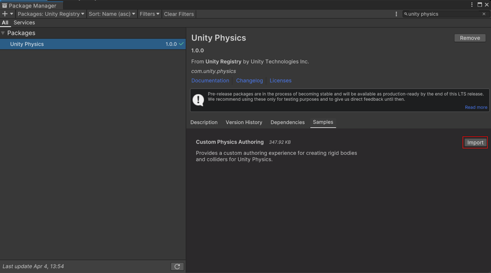

# Authoring using custom physics components

If you’d like to have more fine-grained control over your Physics simulations, refer to the custom Unity Physics authoring components demonstrated in the [PhysicsSamples](https://github.com/Unity-Technologies/EntityComponentSystemSamples) project.
These custom authoring components are included in the package samples.

You can achieve the same runtime outcomes via the familiar and [built-in Physics components](built-in-components.md) that are provided with the Unity Editor through baking by default.

## Import the custom authoring components

You can import the custom authoring components in your project as a package sample via the package manager.

To import the **Custom Physics Authoring** sample, open the Package Manager window (**Window &gt; Package Manager**). Select the Unity Physics package, open the **Samples** tab, then select **Import**.

## Custom authoring components

By manually importing the **Custom Physics Authoring** sample into your project, the following components will be added under **Assets &gt; Samples** (folder).

* [Custom Shape Component](custom-shapes.md)
  * [Custom Material](custom-materials.md)
* [Custom Body Component](custom-bodies.md)
