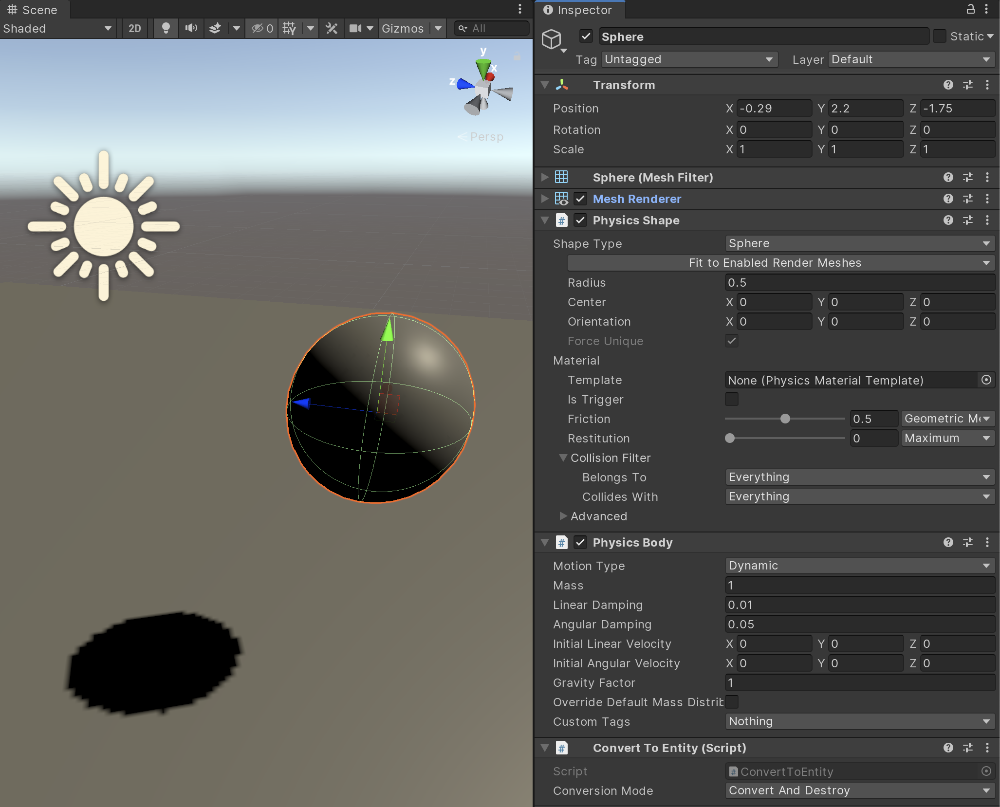
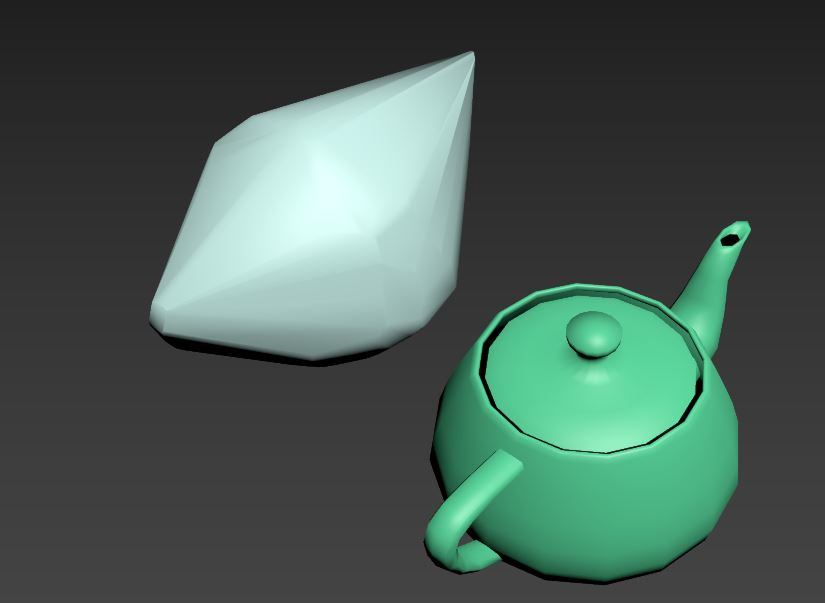
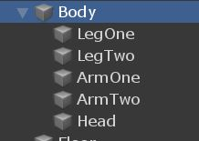
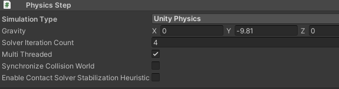

# Simulating

Since the simulation is *state-less*, that is to say does not cache anything frame to frame, the very first thing it needs to do is get all the current state from the components on the body entities. This is the building phase at the start. The simulation then, at a high level, takes all bodies active in the scene and sees what shapes are overlapping. This is the *broadphase* of the simulation. Any that are overlapping, if they should collide based on the *filtering* information on them, we work out the exact point of contact. This is call *narrowphase*. Based on those collisions we can work out a response taking into account all the mass properties (eg inertia), friction and restitution (bounciness), and where they are colliding. We *solve* that collision along with any other joints that may be restricting the body. This solver stage produces new velocities for the affected bodies. We then *integrate* all dynamic bodies forward in time, that is to say move the dynamic bodies by the linear and angular velocities taking the current time step into account. That new transform for the body is then applied to the Entity that represents the body. 

## Setting up a simulation in Editor

First you will need a static body so that your dynamic bodies can hit something and not just fall out of the world. Make a normal 'GameObject->3D Object->Cube'. Set the scale to 20,1,20 say.  Remove the 'Box Collider' component, that is the older Physics representation, we don't need it. Instead add a **'Physics Shape'** component and set its Shape Type drop down to 'Box'. Then select 'Fit to Render Mesh'. The wireframe outline of the collider shape should match up with the graphics version.  If we don't add a 'Physics Body' here it will assume it wants to be a static body, which is fine for this object. We do need to add a **'Convert to Entity'** component though, to tell Unity that the Game Object we see in the editor should become an Entity.

Now add something to collide with the ground. Create 'GameObject->3D Object->Sphere', again remove the Collider that was added. Add a **'Physics Shape'** component as before, this time set Shape Type to 'sphere' and do a 'Fit to Render Mesh'. Since we want to set the body to be dynamic, we need to add a **'Physics Body'** to the object. You will want Motion Type to be 'Dynamic' with a mass of say 1. We again will need a  **'Convert to Entity'**. It should look like the following picture:



To simulate, just press Play in the Editor and it should fall and collide off the floor as expected. You have now just created your first Unity Physics simulation!

## Exploring materials 

With the scene you just made, select the Sphere and change its Physics Shape->Material->Restitution to say 1 and play again. It should now bounce back from collision to nearly where it began. If you change the Linear Damping in the Physics Body to 0, then should get even closer. Play around with the friction (change the rotation of the floor to allow the sphere to roll) and restitution to get a feel of what they can do. The higher the friction the more the sphere will catch and roll rather than just slide, and the higher the restitution the more it will bounce on contact.

## Exploring shapes

So far we have used Box and Sphere for the collision types. Currently six distinct shapes are supported (and then *compound*, so multiple of these in one body, to allow more complex arrangements). Here they are in rough order of how expensive they are to use, from fastest to slowest:

* **Sphere** : a point with radius, so the simplest form of collision shape.
* **Capsule** : a line with radius, so a little bit more expensive than a sphere.
* **Plane** : a plane bounded four sides, so like a quad in graphics, but all 4 corner vertices are coplanar.
* **Box** : an oriented box. 
* **Cylinder** : currently this is actually a convex hull so will have the same cost as a similar complexity hull, so see next.
* **Convex Hull** : a 'convex hull' is as if you wrapped the object in paper, all the holes and concave parts will not be represented, just the outer most features. Collision detection algorithms for something you know is convex is much faster than concave. This is what a convex hull looks like for a teapot:


* **Mesh** : a arbitrary triangle soup. The most expensive and is assumed to be concave. Mesh versus mesh collision in particular can be very expensive, so best practice is to use mesh shapes only for static objects and convex shapes for dynamic objects. But if you know your dynamic mesh shape will not need to collide with another mesh then it can be dynamic, but make sure to setup your collision filtering appropriately.

### What is 'convex radius'

In a lot of the shapes you will see a 'convex radius' field. That is an optimization for collision detection so that it can inflate the hull of the shape a little, like an outer shell of that size around the object. That has the side effect of rounding out corners, so you typically don't want it too big, and is normally quite small with respect to the size of the object.

## Compound Shapes

In order to have more than one shape on a body, and to allow arranging the shapes into a hierarchy that you can transform each shape in the body, we support the notion of Compound shapes. Simply have the gameobject in the Editor with the Physics Body contain children with Physics Shapes. They will all be merged into one compound PhysicsCollider for the body, where the leaf children of that compound collider are the colliders you specified in the Editor. This allows you to make complex rigid bodies made of multiple simpler representations. So collision detection will stay fast and you don't have to settle for say a convex hull around the whole object.

Here is a simple example, where Body is a Physics Body (and a Physics Shape sphere in this case, so shape not only in children but itself too here), and then the children are the Physics Shape box limbs and sphere head. You should only need the normal Convert to Entity on the parent Physics Body, the other gameobjects with just the Physics Shapes should be found by that conversion as is.




## More control over the Physics Step

You can add a **Physics Step** to an object in the scene (just one object in the scene, say an empty object called Physics off the root you can set these values on). Don't forget to add the **Convert to Entity** on the object too.



Try adding that to the sphere scene you had above, and change gravity to be 10 in y instead of the -9.81 default. On play the sphere should 'fall' upwards, instead of down. You can use any value you like for the world gravity, and note also for gravity that you can alter it per body via the Gravity Factor scalar (default is +1, so  1*WorldGravity, but can be any signed float value).

For now 'Unity Physics' is the only choice you should use in the Simulation Type drop down. 
'Havok Physics' will be an option soon to allow the exact same scene setup to be run through the full Havok Physics SDK instead.


# Interacting with physics bodies

Since Unity Physics is purely based in DOTS, rigid bodies are represented component data on the Entities. The simplified 'physics body' and 'physics shape' view you have in the Editor is actually composed of multiple components under the hood at runtime, to allow more efficient access and say save space for static bodies which do not require some of the data.

The current set of components for a rigid body is: 

* PhysicsCollider : the shape of the body. Needed for any bodies that can collide.
* PhysicsVelocity : the current velocities (linear and angular) of a dynamic body. Needed for any body that can move.
* PhysicsMass : the current mass properties (center of mass and inertia) of a dynamic body. Assumed to be infinite mass if not present.
* PhysicsDamping : the amount of damping to apply to the motion of a dynamic body. Assumed to be zero if not present.
* PhysicsGravityFactor : scalar for how much gravity should affect a dynamic body. Assumed to be 1 if not present.
* PhysicsCustomData : custom flags applied to the body, which flow through to events. Assumed to be zero if not present.

For all bodies we require the Unity.Transforms Translation and Rotation component data. This will represent the transform of the body.

So for example to alter velocity of a body, query for its PhysicsVelocity and just set new values as you want. Lets make an example that just attracts all bodies close to a point. We will see later on in collision queries that we dont need to iterate over all bodies to get that subset to affect, but for simplicity lets just go with all here.

First we need to make a ComponentSystem that on update will iterate over all bodies with PhysicsVelocity. We then will check the distance to the Translation of the body and see if close enough to affect. Then just alter the velocity as we want:

```csharp
using Unity.Entities;
using Unity.Transforms;
using Unity.Physics;
using Unity.Mathematics;
using UnityEngine;

public class AttractSystem : ComponentSystem
{
    public float3 center;
    public float maxDistanceSqrd;
    public float strength;

    protected override unsafe void OnUpdate()
    {
        ForEach(
            ( ref PhysicsVelocity velocity,
              ref Translation position,
              ref Rotation rotation) =>
            {
                float3 diff = center - position.Value;
                float distSqrd = math.lengthsq(diff);
                if (distSqrd < maxDistanceSqrd)
                {
                    // Alter linear velocity
                    velocity.Linear += strength * (diff / math.sqrt(distSqrd));
                }
            });
    }
};
```
If we wanted the bodies to go directly to the 'center' point above, we could just set velocity.Linear to be exactly the difference in position. That would get the body there in 1 second, assuming it does not hit anything or be affected by gravity etc en route. If you wanted to get there in one step, you need to know the physics delta time step, say Time.fixedDeltaTime, and divide the linear velocity by that. Note we are not setting position directly, but just altering velocity to get us to where we want to be. That way it can still interact with all other objects in the scene correctly, rather than just teleporting to a given position and hoping for the best. 

To add that test to our scene, the simplest if not pure ECS way, is just to add a MonoBehaviour that alters the system's values. 

```csharp
public class AttractComponent : MonoBehaviour
{
    public float maxDistance = 3;
    public float strength = 1;

    void Update()
    {
        var vortex = World.Active.GetOrCreateSystem<AttractSystem>();
        vortex.center = transform.position;
        vortex.maxDistanceSqrd = maxDistance * maxDistance;
        vortex.strength = strength;
    }
}
```

Add that to a new empty GameObject positioned near the sphere (maybe just above it) and see what happens. Should sort of orbit that point in space (since we are adding a velocity towards the center but not cancelling out gravity down etc or any existing velocity on the object).

### How it should be done

The correct DOTS way to do this would be something along the lines of using  IConvertGameObjectToEntity on the AttractComponent MonoBehavior we made, and in the IConvertGameObjectToEntity.Convert create an AttractData ComponentData with the center and strength etc that you attach to the Entity representing the point to attract to. Then in the AttractSystem do ForEach over all AttractData instead. The most efficient way to get all bodies close to that point is then to use the Unity.Physics.CollisionWorld OverlapAabb or if you want something more exact CalculateDistance (with MaxDistance in it set to our maxDistance above). We will cover such queries later on, so dont worry about it too much here.

## Impulses 

We have seen now how to alter velocity in code, but it can be tricky to work out what velocity values to set to get a desired outcome. A common thing to want to do is apply an impulse at a given point on the body and have it react. To work out the affect on angular velocity from a given linear impulse. So say if shooting the object with a gun. We provide a few `Unity.Physics.Extensions.ComponentExtensions` to do the math for you, for example `ApplyImpulse()`:

```csharp
    public static void ApplyImpulse(ref PhysicsVelocity pv, PhysicsMass pm, 
        Translation t, Rotation r, float3 impulse, float3 point)
        {
            // Linear
            pv.Linear += impulse;

            // Angular
            {
                // Calculate point impulse
                var worldFromEntity = new RigidTransform(r.Value, t.Value);
                var worldFromMotion = math.mul(worldFromEntity, pm.Transform);
                float3 angularImpulseWorldSpace = math.cross(point - worldFromMotion.pos, impulse);
                float3 angularImpulseInertiaSpace = math.rotate(math.inverse(worldFromMotion.rot), angularImpulseWorldSpace);

                pv.Angular += angularImpulseInertiaSpace * pm.InverseInertia;
            }
        }
```
Favour the form of calls that take the raw PhysicsVelocity etc rather than ones that query for them, to try an encourage the code to be more efficient and work over arrays of the data in efficient DOTS style.
Overtime we will provide more, but they will all work off the same PhysicsVelocity and PhysicsMass components you have today, so feel free to implement your own as you need.   

# Creating bodies in code

So we have seen how to create bodies in the editor and how to alter their properties in code, but what about creating them dynamically on the fly. 

If you have a prefab setup with the body, then the SpawnRandomPhysicsBodies used in some of our Unity.Physics samples is a good place to start. Once we ConvertGameObjectHierarchy on the prefab, we get a Entity that we can Instantiate as many times as we like, setting the Translation and Rotation on it. In theory that alone will be fine, but if you want to be super fast you can also let Unity.Physics know they all share the same Collider. The PhysicsCollider, especially in the case of Convex Hull or Mesh shape colliders, can be expensive to create when first seen, so if you know is the same as another body and can share, just set the PhysicsCollider to say so as we do here.


```csharp
using System;
using Unity.Physics;
using Unity.Entities;
using Unity.Mathematics;
using Unity.Collections;
using UnityEngine;
using Unity.Transforms;
using Collider = Unity.Physics.Collider;

public class SpawnRandomPhysicsBodies : MonoBehaviour
{
    public GameObject prefab;
    public float3 range;
    public int count;

    void OnEnable() { }

    public static void RandomPointsOnCircle(float3 center, float3 range, ref NativeArray<float3> positions, ref NativeArray<quaternion> rotations)
    {
        var count = positions.Length;
        // initialize the seed of the random number generator 
        Unity.Mathematics.Random random = new Unity.Mathematics.Random();
        random.InitState(10);
        for (int i = 0; i < count; i++)
        {
            positions[i] = center + random.NextFloat3(-range, range);
            rotations[i] = random.NextQuaternionRotation();
        }
    }

    void Start()
    {
        if (!enabled) return;

        // Create entity prefab from the game object hierarchy once
        Entity sourceEntity = GameObjectConversionUtility.ConvertGameObjectHierarchy(prefab, World.Active);
        var entityManager = World.Active.EntityManager;

        var positions = new NativeArray<float3>(count, Allocator.Temp);
        var rotations = new NativeArray<quaternion>(count, Allocator.Temp);
        RandomPointsOnCircle(transform.position, range, ref positions, ref rotations);

        BlobAssetReference<Collider> sourceCollider = entityManager.GetComponentData<PhysicsCollider>(sourceEntity).Value;
        for (int i = 0; i < count; i++)
        {
            var instance = entityManager.Instantiate(sourceEntity);
            entityManager.SetComponentData(instance, new Translation { Value = positions[i] });
            entityManager.SetComponentData(instance, new Rotation { Value = rotations[i] });
            entityManager.SetComponentData(instance, new PhysicsCollider { Value = sourceCollider });
        }

        positions.Dispose();
        rotations.Dispose();
    }
}
```
Save say the Sphere GameObject with rigid body setup you made earlier as a Prefab (as in just drag it from the scene hierarchy into the Assets view) and add a GameObject with the above SpawnRandomPhysicsBodies on it. Make count 1000 and set range to 2,2,2 and press play. You have now just created your first Unity.Physics runtime effect!


## Creating bodies from scratch

The above used a pre existing prefab we setup in Editor, so glosses over some of what you needed to add, but was close. Here is code similar to CreateBody from the BasicPhysicsDemos in the samples. Our Colliders are stored in highly optimized structures, so some of the interaction with them is currently via 'unsafe' raw pointers, so you will have to bear with that for now here. 

```csharp
using Unity.Entities;
using Unity.Transforms;
using Unity.Physics;
using Unity.Mathematics;
using Unity.Rendering;

public unsafe Entity CreateBody(RenderMesh displayMesh, float3 position, quaternion orientation, 
        BlobAssetReference<Collider> collider,
        float3 linearVelocity, float3 angularVelocity, float mass, bool isDynamic)
{
    EntityManager entityManager = EntityManager;
    ComponentType[] componentTypes = new ComponentType[isDynamic ? 7 : 4];

    componentTypes[0] = typeof(RenderMesh);
    componentTypes[1] = typeof(Translation;
    componentTypes[2] = typeof(Rotation);
    componentTypes[3] = typeof(PhysicsCollider);
    if (isDynamic)
    {
        componentTypes[4] = typeof(PhysicsVelocity);
        componentTypes[5] = typeof(PhysicsMass);
        componentTypes[6] = typeof(PhysicsDamping);
    }
    Entity entity = entityManager.CreateEntity(componentTypes);

    entityManager.SetSharedComponentData(entity, displayMesh);

    entityManager.AddComponentData(entity, new Translation { Value = position });
    entityManager.AddComponentData(entity, new Rotation { Value = orientation });
    entityManager.SetComponentData(entity, new PhysicsCollider { Value = collider });
    if (isDynamic)
    {
        Collider* colliderPtr = (Collider*)collider.GetUnsafePtr();
        entityManager.SetComponentData(entity, PhysicsMass.CreateDynamic(colliderPtr->MassProperties, mass));

        float3 angularVelocityLocal = math.mul(math.inverse(colliderPtr->MassProperties.MassDistribution.Transform.rot), angularVelocity);
        entityManager.SetComponentData(entity, new PhysicsVelocity()
        {
            Linear = linearVelocity,
            Angular = angularVelocityLocal
        });
        entityManager.SetComponentData(entity, new PhysicsDamping()
        {
            Linear = 0.01f,
            Angular = 0.05f
        });
    }

    return entity;
}
```

Getting your RenderMesh etc is up to you, and can create a Collider through the Create() function on each of the different Collider types, something like:

```csharp
  public Entity CreateDynamicSphere(RenderMesh displayMesh, float radius, float3 position, quaternion orientation)
    {
        // Sphere with default filter and material. Add to Create() call if you want non default:
        BlobAssetReference<Unity.Physics.Collider> spCollider = Unity.Physics.SphereCollider.Create(float3.zero, radius);
        return CreateBody(displayMesh, position, orientation, spCollider, float3.zero, float3.zero, 1.0f, true);
    };
```

# Next steps

Now that you can create bodies, it would be a good time to learn about collision queries and filtering. At that stage you should be all set for at least intermediate used of Unity Physics and can progress onto the more advanced topics such as modifying the simulation as it is running via callbacks and getting a deeper understanding of how the code works.

[Collision queries](collision_queries.md)

[(Back to Index)](index.md)
