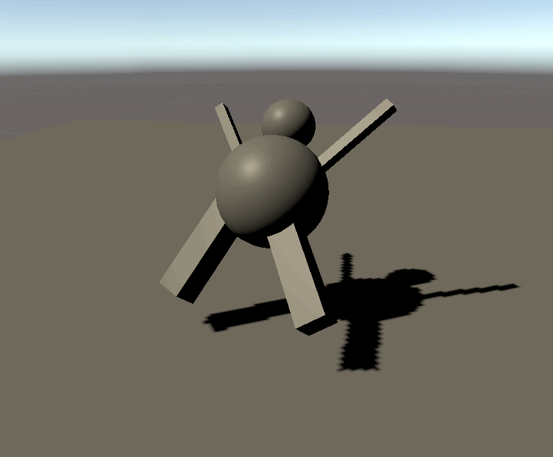

Getting started
=========

# Simulation basics

The Unity Physics simulation occurs in the following order:

1. Since the simulation is *stateless* (i.e. does not cache anything frame to frame), it must get the current state from the components on the body entities.
2. The simulation then, at a high level, takes all active bodies in the scene and checks to see what shapes are overlapping. This is called the *broadphase*.
3. For any shapes that overlap, if they should collide based on their *filtering* information, the exact point of contact is calculated. This is called the *narrowphase*.
4. Based on those collisions, a response can be worked out that takes into account the following parameters:
 * Mass Properties (such as weight and inertia)
 * Friction
 * Restitution (bounciness)
 * Point of collision
5. The collisions are then *solved* along with any other joints that may be restricting the body. This solver stage produces new velocities for the affected bodies.
6. All dynamic bodies are *integrated* forward in time. This is done by moving the dynamic bodies according to their linear and angular velocities while taking the current time step into account.
7. Finally, the new transform for the body is applied to the Entity that represents that body.

## Setting up a simulation in Editor

First you need a static body to act as a floor so that your dynamic bodies can hit something and not just fall out of the world:
1. Create a Cube primitive: **GameObject > 3D Object > Cube**.
2. Make the Cube really wide on the X and Z axes – for example: **(20,1,20)**.
3. Remove the **Box Collider** component. This is the legacy Physics representation and is not necessary for Unity Physics.
4. Add a **Physics Shape** component. The wireframe outline of the collider should match up with the graphical representation.
5. Add a **Convert to Entity** component. This tells Unity that the GameObject you see in the Editor should become an Entity.

Now you need to add something to collide with the ground:
1. Create a Sphere primitive (**GameObject > 3D Object > Sphere**) and ensure to place it above the floor.
2. Remove the **Sphere Collider** component.
3. Add a **Physics Shape** component and set its **Shape Type** to **Sphere**.
4. Since you want the body to fall under simulated gravity, we also need to add a **Physics Body** component to the object.
5. Set the **Motion Type** to **Dynamic** and ensure that there is a **Mass** value (**1** will do for this example).
6. Add a **Convert to Entity** component.

Once all of the steps are done, it should look like the following picture:

To simulate, enter Play mode in the Editor. The Sphere should fall and collide with the floor.

## Exploring materials

Materials are a set of properties that affect how the Physics Body will react when encountering another body. The material properties in Unity Physics include **Friction**, **Restitution** (bounciness) and what the object collides with. Material properties can be saved to a **Physics Material Template** asset as well as set directly in the **Physics Shape** for an object.

Try out some settings with the scene you just made:
1. Select the Sphere and in the **Physics Shape** component's **Material** section, set the **Restitution** to **1**. When you enter play mode, the sphere should now bounce back from collision to nearly where it began.
2. In the **Physics Body** component, change the **Linear Damping** to 0. The sphere should now get even closer.
3. Rotate the floor to allow the sphere to roll and then play around with the sphere’s **Physics Shape > Material > Friction** setting. The higher the friction the more the sphere will catch and roll rather than just slide.
4. Play around with the **Restitution** as well. The higher the restitution the more the sphere will bounce on contact.

## Exploring shapes

So far you have used Box and Sphere for the collision types. You can actually use up to seven distinct shapes (although six shape types are technically supported). Here they are in rough order of how expensive they are to use, from fastest to slowest:

| Shape | Description |
|---|---|
| **Sphere** | A point with radius, so the simplest form of a collision shape. |
| **Capsule** | A line with radius, so a little bit more expensive than a sphere. |
| **Plane** | A plane bounded four sides, so like a quad in graphics, but all 4 corner vertices are coplanar.
| **Box** | An oriented box. |
| **Cylinder*** | Currently this is actually a convex hull so it will have the same cost as a similar complexity hull (* see Convex Hull). |
| **Convex Hull** | A 'convex hull' is as if you wrapped the object in paper, all the holes and concave parts will not be represented, just the outer most features (see the teapot example below). Collision detection algorithms for something you know is convex is much faster than concave. |
| **Mesh** | An arbitrary triangle soup. The most expensive and is assumed to be concave. Mesh versus mesh collision in particular can be very expensive, so best practice is to use mesh shapes only for static objects and convex shapes for dynamic objects. But if you know your dynamic mesh shape will not need to collide with another mesh then it can be dynamic, but make sure to setup your collision filtering appropriately. |

 _Example: how a convex hull looks like for a Utah teapot._

Additionally, Unity Physics supports *Compound* collider shapes. This is a combination of the above shapes that behaves as one Physics Body. This feature is useful in cases where an object has a complicated mesh, but the shape can be approximated using a few simpler colliders to improve performance. You can find more info about this below.

### What is *Bevel Radius*?

Most of the shapes contain a **Bevel Radius** field. This value is an optimization for collision detection that inflates a shape's hull, creating a shell outside its vertices. As implemented in Unity Physics, it simultaneously moves the collision geometry's vertices inward a bit, attempting to best preserve the surfaces of the geometry. Because it has the side effect of rounding out a shape's corners, you typically don't want it too big. You should usually set it to be quite small with respect to the size of the object.

## Compound shapes

The concept of Compound collider shapes allows you to have more than one shape on a body and to arrange the shapes into a hierarchy where you can transform each shape in the body.

A single GameObject with a **Physics Body** component can contain children with **Physics Shapes**. These are going to be merged into one compound ­­`PhysicsCollider` for the body, where the leaf children are the colliders you specified in the Editor.

This allows you to make complex rigid bodies made of multiple simpler representations, so that the collision detection remains fast and you don't have to settle for a convex hull around the whole object.

Here is a simple example, where **Body** is a **Physics Body**, the children are the **Physics Shape** box limbs and a sphere head.

 _Compound shape hierarchy._

> **Note:** Only the parent (**Body**) needs a **Convert to Entity** component. The child GameObjects with just the **Physics Shape** components are automatically discovered and converted.

 _The Compound shape in Play mode._

## Control over the Physics Step

You can add a **Physics Step** component to an object in the scene to modify some scene-specific settings like **Gravity** and **Solver Iteration Count**.
>**Important:** You should not have more than one **Physics Step** component in a Scene, otherwise only the first one in the hierarchy will be executed.

As usual when working with *Entities*, a **Convert to Entity** component is also necessary.

 _Physics Step component_

Try adding that to the scene you previously created, and change **Gravity** in the Y-axis to be **10** (instead of the default **-9.81**). After entering Play mode, the sphere should 'fall' upwards instead of down. You can use any value you like for the world gravity.
>**Note:** You can also alter gravity per body via the **Gravity Factor** scalar (default is **1**, so  1*WorldGravity, but can be any positive or negative float value).

You can select _Havok Physics_ in the **Simulation Type** drop down if you have installed the Havok Physics package and would like to use it to simulate. Otherwise use the default selection, _Unity Physics_.

# Physics Body data

Since Unity Physics is purely based on DOTS, rigid bodies are represented with component data on the Entities. The simplified **Physics Body** and **Physics Shape** view that you have in the Editor is actually composed of multiple data components under the hood at runtime. This allows more efficient access and to save space for static bodies which do not require some of the data.

The current set of data components for a rigid body is as follows:

| Component | Description |
|--|---|
|`PhysicsCollider`      | The shape of the body. Needed for any bodies that can collide. |
|`PhysicsVelocity`      | The current linear and angular velocities of a dynamic body. Needed for any body that can move. |
|`PhysicsMass`          | The current mass properties (center of mass and inertia) of a dynamic body. Assumed to be infinite mass if not present. |
|`PhysicsDamping`       | The amount of damping to apply to the motion of a dynamic body. Assumed to be zero if not present. |
|`PhysicsGravityFactor` | The scalar for how much gravity should affect a dynamic body. Assumed to be 1 if not present.
|`PhysicsCustomData`    | Custom flags applied to the body. They can be used for certain collision event applications. Assumed to be zero if not present. |

All physics bodies require components from `Unity.Transforms` in order to represent their position and orientation in world space. Physics ignores any scale of rigid bodies. Any scale applied to converted GameObjects is baked into a `CompositeScale` component (to preserve the scale of the render mesh at bake time) and the `PhysicsCollider` component (to approximate the scale of the physics geometry at bake time).

Dynamic bodies (i.e., those with `PhysicsVelocity`) require `Translation` and `Rotation` components. Their values are presumed to be in world space. As such, dynamic bodies are unparented during entity conversion.

Static bodies (i.e., those with `PhysicsCollider` but without `PhysicsVelocity`) require at least one of either `Translation`, `Rotation`, and/or `LocalToWorld`. For static bodies without a `Parent`, physics can read their `Translation` and `Rotation` values directly, as they are presumed to be in world space. World space transformations are decomposed from `LocalToWorld` if the body has a `Parent`, using whatever the current value is (which may be based on the results of the transform systems at the end of the previous frame). For best performance and up-to-date results, it is recommended that static bodies do not have a `Parent`.

`BuildPhysicsWorld` and `ExportPhysicsWorld` systems expect the chunk layouts for rigid bodies to be the same at both ends of the physics pipeline in order to write the simulation results to component data. Making structural changes (adding/removing entities with physics components, or adding/removing new components to them) between these two systems is not safe.
Modifying `PhysicsCollider` between these two systems is also not safe. Modifying `Translation`, `Rotation` and `PhysicsVelocity` of dynamic rigid bodies between these two systems serves no purpose, since `ExportPhysicsWorld` will write back to ECS data at the end of the simulation.

The [Interacting with bodies](interacting_with_bodies.md) section provides more info on how to interact with Physics Bodies and their data.
