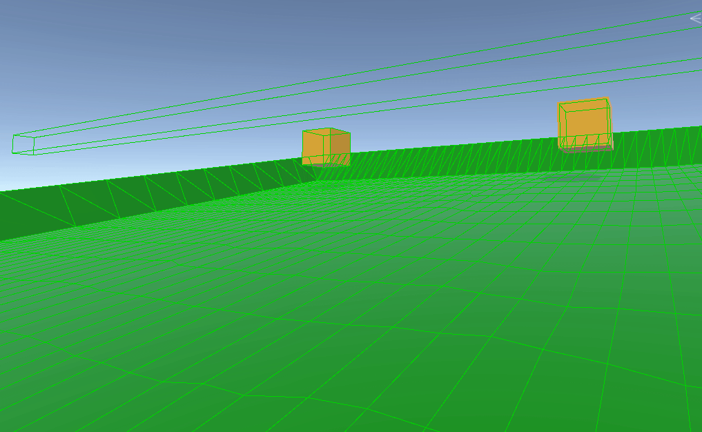
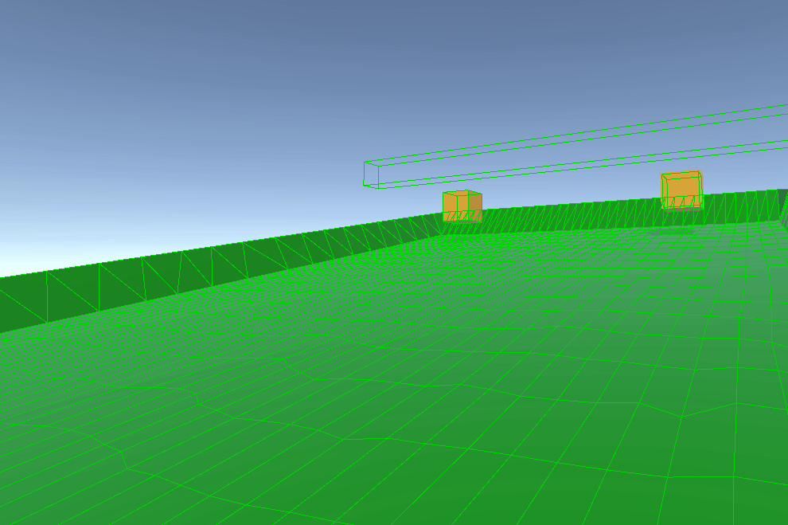

# Ghost Collisions
Ghost collisions are a well documented issue in game physics systems. They occur when dynamic objects moving across a surface bump into unintended collisions at the boundaries or connections between adjacent physics colliders. These collisions arise due to the discrete nature of collision detection and the way most physics engines calculate the interaction between colliders.

Ghost collisions can lead to undesired collision forces being applied to bodies. As a result, bodies might **catch** on other colliders, which manifests in implausible behavior such as bodies bouncing or stopping abruptly. Likewise, ghost collisions also cause collision events to be issued unexpectedly.

This issue is most likely to occur when rigid bodies move at high speeds relative to the size of the colliders they interact with. Additionally, ghost collision issue is not exclusive to specific collider types but is more likely to occur when:

- Colliders are composed of multiple connected elements, like triangles in a mesh.
- Colliders are convex and overlap with adjacent edges or vertices.

A classic example of ghost collisions can be seen in a box sliding across two connected edges. As it transitions from one edge to the next, the physics system might interpret the connection as a collision and generate a response force that blocks or redirects the box's movement. As the image illustrates in the following scenario, a box falls from the top of a sloped mesh surface.

Instead of sliding smoothly, the box collides with every segment of the mesh. This leads to unexpected behavior, such as the box stopping or experiencing abnormal friction as it moves. The collision system incorrectly tries to stop the box while simultaneously pushing it along the surface's normal direction. During this process, contact points are registered along the mesh's surface. These points, indicated by pink lines, represent the areas where the box intersects with the surface. As a result, these contact points alter the dynamics of the collision, affecting how the box interacts with the surface.



## Possible causes
- **Edge Connections:** Adjacent colliders, such as triangles or line segments, share vertices or edges. The physics engine calculates interactions per **shape independently**.

- **Separating Planes:** In collision detection, a separating plane is defined to prevent objects from overlapping each other. When the plane is misaligned due to edge transitions, the object might collide with it unnecessarily.

- **Discrete Time Steps:** Physics engines operate in discrete simulation steps. If an object moves rapidly between frames, it might erroneously interact with shapes it shouldn't have encountered in a continuous simulation.

- **Shape Complexity:** More complex colliders, such as those with high triangle counts or multiple shared vertices, increase the likelihood of ghost collisions.

## To mitigate ghost collisions, try techniques such as:

- **Narrowphase Contact Modification:** Narrowphase modifies collision predictions by smoothing the interaction between connected colliders. It ensures that contact points across adjacent colliders are treated as part of a continuous surface rather than separate elements. [Checkout Unity Physics Samples for more details](#narrow-phase-contacts-solution).

- **Detailed Static Mesh Collision:** For static geometry to provide context about neighboring colliders, enabling the system to eliminate ghost collisions by leveraging ghost vertices for smoother transitions due to it processes contact detection for dynamic objects colliding with static colliders across both the current and next frame. This helps predict and refine collision accuracy. [Checkout Custom Physics Body Component for more details](custom-bodies.md) or add **Detailed Static Mesh Collision** component alongside the collider at the same component level.

- **Reducing Shape Complexity:** Simplifying collision colliders by reducing triangle counts or using convex hull approximations minimizes the potential for ghost collisions.

- **Smaller Time Steps:** Reducing the simulation's delta time enhances collision detection accuracy, minimizing the likelihood of ghost collisions. However, keep in mind that while a smaller time step increases precision, it can also impact performance, so it's important to balance accuracy with computational efficiency.

- **Voronoi Regions (Optional custom solution):** A Voronoi region defines the valid range of collision normals for an edge. If a calculated collision normal lies outside this range, it is ignored or adjusted to align with the nearest valid normal.

## Practical Examples
- **Mesh Colliders:** Ghost collisions frequently appear in mesh colliders where the dynamic body interacts with individual triangles. For example, a car driving over a terrain mesh might bounce unexpectedly at triangle edges.

- **Vehicles:** Representing a car as a single convex hull (excluding wheels) can significantly reduce ghost collision artifacts. By avoiding multiple small colliders, the physics engine treats the vehicle as a single entity, ensuring smoother interactions.

- **Game Worlds:** For large, complex levels, using chain colliders or composite colliders in **"outline"** mode can create continuous surfaces that minimize ghost collisions.

## Narrow Phase Contacts solution

In a physics simulation, the narrow phase is responsible for resolving collisions between objects. Within this system, the [narrow-phase](https://github.com/Unity-Technologies/EntityComponentSystemSamples/blob/master/PhysicsSamples/Assets/9.%20Modify/Scripts/ModifyNarrowphaseContactsBehaviour.cs) contact solution efficiently manages collisions involving composite mesh colliders by calculating precise surface normals for each contact point and adjusting them based on the surfaces they interact with. This ensures accurate contact resolution, preventing issues such as objects improperly sticking together or interpenetrating. The method is optimized for handling complex colliders and improves performance, especially when working with large mesh colliders.

**ModifyNormalsJob:** This job iterates over contact points and adjusts the normal when the entity involved matches the specified surface entity. If a mesh is involved, it retrieves the surface normal from the polygon plane and adjusts the contact normal accordingly.

$$
\text{dot product} = \mathbf{v1} \cdot \mathbf{v2} = |\mathbf{v1}| |\mathbf{v2}| \cos(\theta)
$$

$$
\text{dot product} = \mathbf{surface Normal} \cdot \mathbf{contactHeader Normal} = |\mathbf{surface Normal}| |\mathbf{contactHeader Normal}| \cos(\theta)
$$


**Job Check and Surface Evaluation**
The first step is to check if either of the entities involved in the collision corresponds to the surface entity:

```csharp
bool isBodyA = (contactHeader.EntityA == SurfaceEntity); // is the entity A the surface?
bool isBodyB = (contactHeader.EntityB == SurfaceEntity); // is the entity B the surface?
```

If either entity is the surface, the next step is to determine if the entity has any leaf or child colliders attached to the main collider. This is relevant when dealing with mesh surfaces with multiple attached leaf colliders.

```csharp
        // if we have a mesh surface we can get the surface normal from the plane of the polygon
        var rbIdx = CollisionWorld.GetRigidBodyIndex(SurfaceEntity);
        var body = CollisionWorld.Bodies[rbIdx];

        // this is only called in case the mesh has multiple Leaf attached to the main Coillider
        if (body.Collider.Value.CollisionType == CollisionType.Composite)
        {
            unsafe
            {
                body.Collider.Value.GetLeaf(isBodyA ? contactHeader.ColliderKeyA : contactHeader.ColliderKeyB, out ChildCollider leafCollider);
                if (leafCollider.Collider->Type == ColliderType.Triangle || leafCollider.Collider->Type == ColliderType.Quad)
                {
                    PolygonCollider* polygonCollider = (PolygonCollider*)leafCollider.Collider;
                    // Potential optimization: If TransformFromChild has no rotation just use body.WorldFromBody.rot
                    // This is likely if you only have a MeshCollider with no hierarchy.
                    quaternion rotation = math.mul(body.WorldFromBody.rot, leafCollider.TransformFromChild.rot);
                    float3 surfaceNormal = math.rotate(rotation, polygonCollider->Planes[0].Normal);
                    distanceScale = math.dot(surfaceNormal, contactHeader.Normal);
                    contactHeader.Normal = surfaceNormal;
                }
            }
        }
```
Finally, the `Distance` value is adjusted by applying the computed `distanceScale`. If the collider is not a composite collider, the result will be `0` for the distance by default.

```csharp
    contactPoint.Distance *= distanceScale;
```

It also scales the distance based on the dot product between the first contact normal on the surface and the contact point normal, adjusting the distance used for collision calculations to ensure greater accuracy with the current position of the collider.

The result of applying this approach to the ghost collision issue described in the **first image** is that the box now slides more **smoothly** across the surface, even with multiple contact points (represented by the pink lines). These contact points are evaluated against the surface normal based on the first collision detection point and its associated surface normal.

