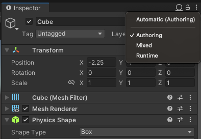
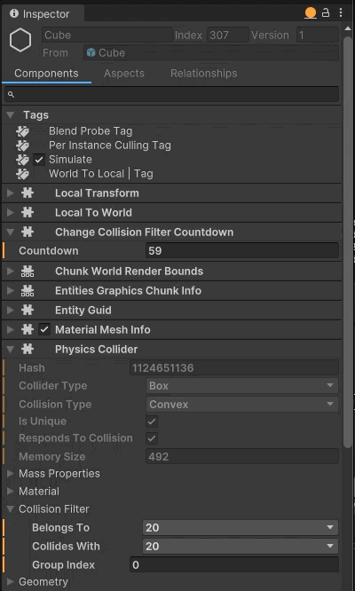
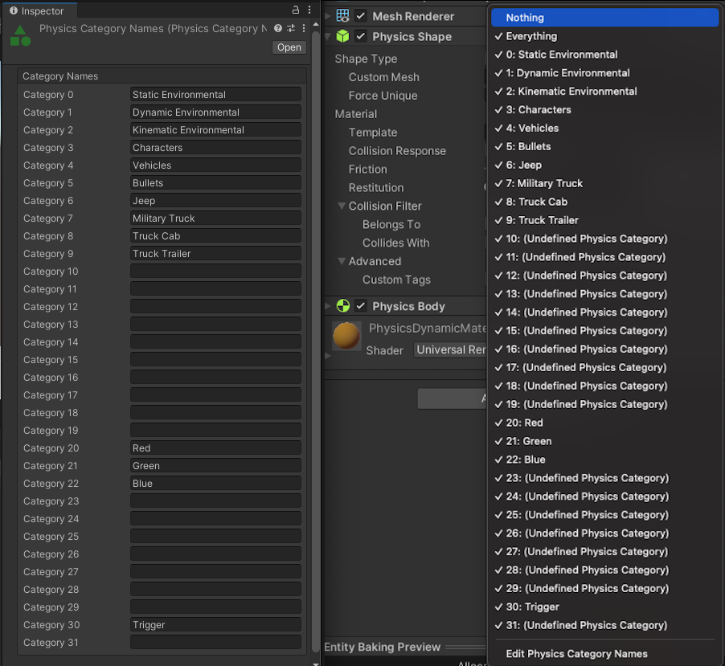
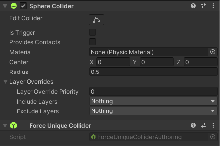

# The *PhysicsCollider* component

This is the most important component for the simulation of physics. By adding this component to an entity, you declare that this body will participate in the physics simulation and collision queries (though you also need transform components: `LocalTransform` for dynamic bodies, `LocalTransform`, and/or `LocalToWorld` for static bodies). This component decides what the collision geometry "looks" like to the physics simulation. It is analogous to a mesh in a rendering system.

For performance reasons, you should try to avoid using a mesh during physics – use specialized primitive types when possible, which greatly simplifies the process of determining collisions between two Colliders. For example, if a collision geometry can be represented by a sphere, you can write collision tests which only need to consider the sphere center and radius; with a mesh wrapping the same sphere, you would need to consider every triangle in the mesh.

The most important property of a `PhysicsCollider` is a [`BlobAssetReference`](xref:Unity.Entities.BlobAssetReference`1) to the Collider data used by the physics simulation (which is in a format optimized for collision queries). If you aren't familiar with blob assets, we recommend you review the [available documentation](xref:blobassets). Each of the Collider types implement an `ICollider` interface, and for each Collider type, there is a static `Create()` function, which takes parameters specific to the shape. For example, a `SphereCollider` is built from a position and a radius, while a `ConvexCollider` is built from a point cloud.

>[!NOTE]
>It is possible to create a Collider which has a null `BlobAssetReference`. Unity Physics still simulates the body, but it cannot collide with anything. This can be useful in some particular scenarios – for example you can connect such a body to another body using a joint, and feed the simulated positions into your skinning system.

## Collider types
Various collider types are supported in Unity Physics. The collider type of every `PhysicsCollider` is defined by its `Collider` blob and can be obtained through the `Collider.ColliderType` property.

| Type            | Name               | Description                                                                                                                           |
|-----------------|--------------------|---------------------------------------------------------------------------------------------------------------------------------------|
| Convex          | `ConvexCollider`   | A collider in the shape of an arbitrary convex hull created from a set of 3D points.                                                  |
| Sphere          | `SphereCollider`   | A collider in the shape of a sphere defined by a radius.                                                                              |
| Capsule         | `CapsuleCollider`  | A collider in the shape of a capsule formed by an inner line segment and a radius.                                                    |
| Triangle / Quad | `PolygonCollider`  | A flat convex collider with either 3 or 4 coplanar vertices forming either a triangle or a quad, respectively.                        |
| Box             | `BoxCollider`      | A collider in the shape of a box represented by a local center position and a 3D size parameter, defining the three box side lengths. |
| Cylinder        | `CylinderCollider` | A collider in the shape of a cylinder represented by a local position and orientation, and a cylinder height and radius.              |
| Mesh            | `MeshCollider`     | A collider representing a mesh comprised of triangles and quads.                                                                      |
| Compound        | `CompoundCollider` | A collider containing instances of other colliders.                                                                                   |
| Terrain         | `TerrainCollider`  | A collider representing a terrain described by a uniform grid of height samples.                                                      |

## Working with collider data

Using the Inspector to display runtime data can be a powerful tool to examine a `PhysicsCollider` component and its collider blob. To show this data, have the subscene open for editing and have a GameObject selected. Navigate to the top right corner of the Inspector and click on the circle icon (see Figure 1) and choose the 'Runtime' option to display the entity components that are baked from this GameObject.

<br/>_Figure 1: How to navigate to the Runtime View in the Inspector._ 

Figure 2 shows an example of the Inspector dynamically updating in Runtime View while the `CollisionFilter` in a collider is modified each time a specified counter value is reached.

<br/>_Figure 2: An example of the Inspector updating in Runtime View._

# Dynamic bodies

By itself, a world containing entities with `PhysicsCollider` components won't actually _do_ anything. This is because the bodies you declare are all treated as static – they cannot move, and from the perspective of collision, they have infinite mass. In order to make our simulations more interesting, you need to add the ability for body transforms to change.

Adding a `PhysicsVelocity` component makes the physics simulation aware that the Collider can have some linear and angular speed and that the Collider should move. You can change the values of this component yourself if you wish to control how a Collider is moving, but during the physics simulation, Unity Physics also computes a new value for velocity (from gravity and forces from contacts/joints) and updates the component.

# The collision filter

Each Collider also has a `CollisionFilter` which allows you to control what objects are permitted to collide with each other. The properties on this object allow you to categorize objects in relation to what types they collide with. For example, you might want to mark certain Colliders as "transparent" so that when performing a raycast test to determine if two characters can see each other, they are able to "see through" Colliders which are flagged as "transparent".

The default values in the colliders' collision filters ensure that every object collides with every other object. By configuring the filter in particular ways, you are able to opt-out of select collisions, depending on what you want to achieve in your game.

The filter contains two bitfield properties, `CollisionFilter.BelongsTo` and `CollisionFilter.CollidesWith` which are described in more detail below. Both these properties can be modified using standard bit manipulation. For example, to set the n'th bit in a property you can use `property |= 1 << n`.

The `BelongsTo` bitfield allows the collider to be assigned to one or more categories, such as "transparent" or "water", where each bit represents a single categorie.

The `CollidesWith` bitfield uses the same concept of categories, and together with the `BelongsTo` bitfield allows you to control what categories this collider will or will not collide with. Setting the bit of a given category in the `CollidesWith` bitfield will enable collision between this collider and the specified category. Analogously, if the bit is not set, collision between this collider and the specified category will be disabled. Collision with more than one category can be enabled by setting multiple bits accordingly.

Note that for a collision to take place, the filter in both colliders need to specify that there should be collision with the other collider. For example, say you have a collider A and a collider B, and the filter in collider A enables collision with collider B, but the filter in collider B disables collision with collider A. In this case, the two colliders will not collide.

Finally, the filter's `GroupIndex` property lets you override the `CollidesWith` and `BelongsTo` behavior described above. When this value is non-zero, the `CollidesWith` and `BelongsTo` properties are not checked at all. If the `GroupIndex` of both objects is equal and positive, then the object will always collide. If the value in both objects is equal and negative, then the objects will never collide. By default, this value is set to zero, and thus its overriding function disabled.

## Authoring collision filters

Collision filters can be modified at runtime as described above, and also specified at edit-time by using authoring components. When using the [custom physics authoring](custom-samples-physics-components.md) components, the available collision filter categories can be assigned names in your project by creating a `Physics Category Names` asset under _Assets -> Create -> Unity Physics -> Physics Category Names_. Up to 32 categories can be defined, corresponding to the bits in the collision filter's bitfields described above.
<br/>_Figure 3: A custom authoring's `Physics Category Names` asset, defined in a project (left). An example of the `CollisionFilter.BelongsTo` field in a `Physics Shape` when the collider is set to collide with Everything (right)._

When the [built-in physics authoring components](built-in-components.md) are used, the collision filter's bitfield categories are set based on the game object's [Layer](xref:LayerBasedCollision) and the [include](xref:Collider-includeLayers) and [exclude](Collider-excludeLayers) layer masks specified in the game object's [Rigidbody](xref:class-Rigidbody) or [Collider](xref:CollidersOverview) components (see "Layer Overrides" section in the Inspector).

# Collider sharing and unique colliders

During the rigid body baking process, colliders are automatically shared by multiple rigid bodies, if they all use the exact same geometry shape and size parameters, and have the same collision filter and material settings. This automatic collider sharing is the default behavior in Unity Physics. The `PhysicsCollider` components of such rigid bodies will all refer to the exact same collider `BlobAssetReference` via their `PhysicsCollider.Value` fields.
Especially when mesh-based colliders are involved, this type of data sharing can have significant memory and performance benefits.

A consequence of this data sharing is that if a collider is modified, this change is applied to all the other identical and shared colliders. Sometimes this is beneficial and expected, but in cases when it is not, you can always make a shared collider unique to ensure the change is applied only to this collider instance. How to prevent a collider from being shared by making it unique so that it can be modified exclusively is described in the following section.

## Making colliders unique during authoring

There are multiple ways to make a collider unique, depending on how you are authoring your `PhysicsCollider`. If you are using the `Physics Shape` custom authoring component, then enable its `Force Unique` checkbox (see Figure 4).

<br/>_Figure 4: The Force Unique checkbox in the `Physics Shape` custom authoring component._

If you are using a built-in collider type, then to make it unique, add the `Force Unique Collider` authoring component (see Figure 5) to the same game object.

<br/>_Figure 5: The Force Unique Collider component is used with a built-in collider to mark it as unique._

When using the `Force Unique Collider` component, the uniqueness will be applied to all colliders on a game object where this component is present. If a `Physics Shape` is used on this game object, but it does not have the `Force Unique` checkbox enabled, the `Force Unique Collider` component will take priority.

Also when forcing colliders unique within game objects in Prefabs with any of the above described methods, all Prefab Instances will contain unique colliders as expected.

>[!NOTE]
> The force unique feature is not yet supported for Compound Colliders. Compound Colliders, created during baking, will always be shared if possible.

## Making colliders unique at runtime

You can also take an authored collider and make it unique at runtime if ever you need to modify it. This lets you benefit from automatic collider sharing by default, and gives you the freedom to make only those colliders unique that you need to be unique for runtime modifications at a specific point in time.

For this case, you can check if a collider is already unique using its `IsUnique()` function, and if it is not, simply call its `MakeUnique()` function to disable collider sharing for this collider at this moment. An example usage of this method is in the code snippet below, where we want to change the restitution of one instance of some potentially shared collider.

```csharp
// Make the physics collider unique if it isn't already.
if (!physicsCollider.IsUnique)
{
    physicsCollider.MakeUnique(entity, EntityManager);
}

// Modify the restitution of the collider
physicsCollider.Value.Value.SetRestituion(0.5f);
```

# Modifying colliders

Colliders can be modified via the `PhysicsCollider` component's `BlobAssetReference<Collider>` value. Caution should be taken when modifying this collider blob for two reasons. First, because you are modifying data which is potentially shared, and second, because the timing of this operation will matter to the physics simulation. It is generally safe to modify collider data in jobs that declare write access to the `PhysicsCollider` component, but it should be avoided when write-access is not specified. Additionally, this modification should be timed so that it happens before or after the physics simulation, or else you may encounter issues. 

To make a change in a collider you need to access the corresponding `PhysicsCollider` component using any of the available methods, e.g., `EntityManager.GetComponentData<PhysicsCollider>(entity)`. Then, you can change the data within the collider blob directly, while remaining aware of the collider blob potentially being shared across multiple `PhysicsCollider` components, or after ensuring it is unique as explained in the previous section.

The following example code snippet demonstrates how to change a collider's collision filter.

```csharp
// Change the filter to CollisionFilter.Zero using Burst-compiled job
// This is the recommended way of changing the PhysicsCollider, as it is Burst compatible.
// As long as components are accessed by reference instead of by value, the change will
// be picked up by the physics engine, and will work as intended.

using UnityEngine;
using Unity.Entities;
using Unity.Burst;
using Unity.Physics;

public partial class ChangeColliderSystem : ISystem
{
    [BurstCompile]
    public partial struct ChangeColliderJob : IJobEntity
    {
        [WithAll(typeof(ChangeColliderFilterJob))]
        public void Execute(ref PhysicsCollider collider)
        {
            collider.Value.Value.SetCollisionFilter(CollisionFilter.Zero);
        }
    }

    [BurstCompile]
    public void OnUpdate(ref SystemState state)
    {
        state.Dependency = new ChangeColliderJob().Schedule(state.Dependency);
    }
}

```

```csharp
// Changing the PhysicsCollider using EntityManager.Get/SetComponentData.
// This is not the recommended way, since it isn't Burst friendly, but if needed
// this is how it needs to happen
for (int i = 0; i < entities.Length; i++)
{
    var entity = entities[i];
    var collider = EntityManager.GetComponentData<PhysicsCollider>(entity);

    collider.Value.Value.SetCollisionFilter(CollisionFilter.Zero);

    // IMPORTANT: collider has been changed, but the PhysicsCollider component data hasn't
    // been written back to, and if left at this state, the change might not get caught by
    // the physics engine, so it is necessary to proceed with the write back using SetComponentData
    EntityManager.SetComponentData(entity, collider);
}
```

## Runtime collider creation
It is possible to create colliders manually and during runtime through the various collider types' static `Collider.Create()` functions. These functions produce collider blobs which can be assigned to a `PhysicsCollider` component's `Value` field. The `PhysicsCollider` component in turn has to be added to some entity in order to become part of the physics simulation.

Creating a `PhysicsCollider` component at runtime can be a time-consuming process since adding this component to an entity incurs a structural change. Therefore, this operation should be done with care.
To avoid structural changes, it is possible to create a `PhysicsCollider` component with a null `BlobAssetReference` ahead of time and to assign another, non-null collider blob at a later moment during runtime.

>[!NOTE]
> When a new `BlobAssetReference<Collider>` is manually created, it is up to you to keep track of the reference and dispose of it when the asset is no longer needed. To do this, you could add the `BlobAssetReference` to a NativeList for later disposal. 

The following code snippet demonstrates an example of how to create a `MeshCollider` from a `UnityEngine.Mesh` in a job. Note that you cannot directly use `UnityEngine.Mesh` in a job, because it is a managed component; instead, you must pass either the `MeshData` or `MeshDataArray` into the job. Manual management of the BlobAssetReference lifetime is required in this situation.

```csharp
struct CreateFromMeshDataJob : IJobParallelFor         
{
    [ReadOnly] public NativeArray<UnityEngine.Mesh.MeshData> MeshData;
    [WriteOnly] public NativeArray<BlobAssetReference<Collider>> ColliderBlobReference;

    public void Execute(int i)
    {
        ColliderBlobReference[i] = MeshCollider.Create(MeshData[i], CollisionFilter.Default, Material.Default);
    }
}
  
public void MeshCollider_CreateFromJob(UnityEngine.Mesh engineMesh)
{
    int num = 3; // We are 3 creating colliders of the same mesh for example purposes only.
    var colliderBlobReferenceTracking = new NativeArray<BlobAssetReference<Collider>>(num, Allocator.Persistent);

    using var meshData = new NativeArray<UnityEngine.Mesh.MeshData>(num, Allocator.TempJob);

    for (int i = 0; i < num; i++)
    {
        var meshDataArray = UnityEngine.Mesh.AcquireReadOnlyMeshData(engineMesh);
        meshData[i] = meshDataArray[0];
    }

    new CreateFromMeshDataJob()
    {
        MeshData = meshData,
        ColliderBlobReference = colliderBlobReferenceTracking
    }.Run(num);

    for (int i = 0; i < num; i++)
    {
        var physicsCollider = new PhysicsCollider
        {
            Value = colliderBlobReferenceTracking[i]
        };
        // do stuff
    }

    // Make sure to dispose of the collider blobs that are tracked in
    // colliderBlobReferenceTracking once the blobs are no longer required.
    ...
}
```

For a more complex demonstration of runtime collider creation, refer to the [Unity Physics Samples Project](https://github.com/Unity-Technologies/EntityComponentSystemSamples/tree/master/PhysicsSamples); specifically the Modify/Runtime Collider Modification section in a demo called "Runtime Collider Creation". This demo focuses on using `UnityEngine.Mesh` to create several `MeshCollider`s at runtime as a reaction to a trigger event.

# Scaling colliders
All collider types can be uniformly scaled at run-time when they belong to a dynamic rigid body. This can be achieved by modifying the `Scale` member in the entity's `LocalTransform` component as described in the [previous section](concepts-data.md).

Besides uniform scaling, additional non-uniform and type specific scaling can be achieved through use of the individual collider types' geometric parameters.
For example, a box could be scaled by modifying its width, length and height, or a cylinder could be changed in height or radius, etc.
Primitive types (Sphere, Box, Capsule and Cylinder), mesh collider types (Mesh, Convex and Terrain), and compound colliders support such non-uniform scaling.

>[!NOTE]
> When the geometry of a collider is modified during runtime using the collider's type-specific geometric shape parameters, the mass properties in the `PhysicsMass` component of the rigid body will remain the same, while the `MassProperties` property of the collider will be automatically adjusted to the new shape.

For a demonstration of both uniform and non-uniform scaling of colliders at runtime, please refer to the [Unity Physics Samples](https://github.com/Unity-Technologies/EntityComponentSystemSamples/).

# Mass

Suppose you have a scene with two physics Colliders, one of which has a velocity pointing towards the static Collider. When you enter Play mode, the moving Collider moves right through the static one. You haven't changed the collision filter, or made one a trigger, so what happened? This is a case of an unstoppable force meeting an immovable object. As explained before, the Collider without a velocity cannot move. When the two collide, you would expect forces to be applied between them.

The problem is that, even though one Collider is moving, the simulation does not know how _heavy_ it is, so it does not know how it would respond to collisions. In this case, Unity Physics treats the moving Collider as if it had an _infinite_ mass, so it will just push every object out of the way.

This kind of behaviour is useful in some scenarios. Suppose you had an elevator object in-game. It makes sense that it should follow your desired path _exactly_ – it should move no matter how many characters are in the lift and it should not get stuck on "snags" inside a bumpy elevator shaft. This behaviour is sometimes called "kinematic" or "keyframed" in other physics simulations.

To inform the simulation of masses, you can use the `PhysicsMass` component. This tells Unity Physics how a Collider reacts to an impulse. It stores the mass and [inertia tensor](https://en.wikipedia.org/wiki/Moment_of_inertia) for that entity as well as a transform describing the orientation of the inertia tensor and center of mass.

>[!NOTE]
>Some of these values are stored as inverses, which speeds up many of the internal physics calculations. It also allows you to specify infinite values, by setting the relevant component to zero.

While you can provide these values yourself, it is not necessary in many cases; the `ICollider` for a Collider interface has a `MassProperties` property, where appropriate values are calculated for you automatically. You might find it more useful to use the calculated `MassProperties` property as a starting point, and then scale them – for example, by multiplying the mass by ten for an extra-heavy gameplay object.

