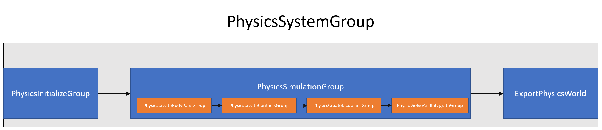

# Physics Pipeline

All physics jobs (initializing simulation data, stepping, and exporting data to ECS) are executed inside `PhysicsSystemGroup`. It is a `ComponentSystemGroup`, and is a subgroup of `FixedStepSimulationSystemGroup`. Therefore, multiple physics steps can occur during one frame. 

`PhysicsSystemGroup` consists of two other subgroups, each responsible for a single phase in physics step, and `ExportPhysicsWorld` system, which schedules jobs that convert physics simulation data to ECS data (`LocalTransform` and `PhysicsVelocity`).
Subgroups are:

| System group             | Description                                                                                             |
|--------------------------|---------------------------------------------------------------------------------------------------------|
| `PhysicsInitializeGroup` | Schedules the jobs that create physics simulation data from ECS data for the current simulation step.   |
| `PhysicsSimulationGroup` | Schedules the jobs that execute physics simulation pipeline.                                            |

`PhysicsSimulationGroup` is further divided into four other subgroups that are responsible for different stages of simulation, and between which it is possible to modify physics simulation data.
Those are:

| System group                    | Description                                                         |
|---------------------------------|---------------------------------------------------------------------|
| `PhysicsCreateBodyPairsGroup`   | Schedules the jobs that find pairs of bodies whose AABB's overlap.  |
| `PhysicsCreateContactsGroup`    | Schedules the jobs that create contacts based on overlapping pairs. |
| `PhysicsCreateJacobiansGroup`   | Schedules the jobs that create jacobians based on created contacts. |
| `PhysicsSolveAndIntegrateGroup` | Schedules the jobs that solve jacobians.                            |

The running order is illustrated in the image below:

