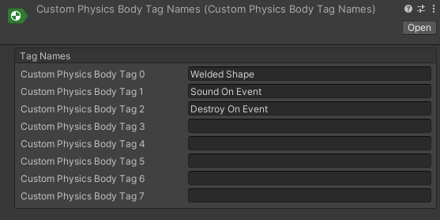
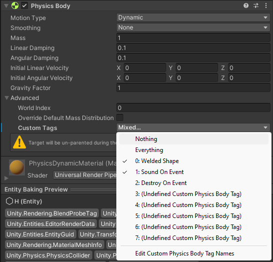

# Custom Physics Body Tag

To define a custom behavior, add custom component data to an entity and then check if an entity contains certain component data in the code of an event handler or a modifier.

If you're using custom component data as a flag (when it's an empty `IComponentData`), there are few downsides to this approach:

* Creating an empty authoring component and baker for empty component data adds more boilerplate code.
* Adding and removing component data requires sync points.
* A large number of optional components in your modifer or event handling jobs and then checking if entity contains those components can slow down performance.

You can use a Custom Physics Body Tag to work around these restrictions, and flag up to eight custom behaviors for each rigid body. Some [modifiable intermediate simulation data](simulation-modification.md), like `ModifiableContactHeader`, already contains custom physics body tag values. In other cases, game logic can get the `Rigidbody.CustomTag` value by pulling `Rigidbody` data from `CollisionWord.Bodies` array:

```csharp
NativeArray<RigidBody> allBodies = SystemAPI.GetSingleton<PhysicsWorldSingleton>().CollisionWorld.Bodies;
byte bodyTags = allBodies[bodyIndex].CustomTags;
```

## Custom Physics Body Tag authoring

You can set Custom Physics Body Tags through code as flags. However, it's more convenient to do so through the Unity Editor. To assign a name for each of the Custom Physics Body Tags in the Editor, right click on the folder where you want to save the definition file and select **Create** &gt; **Unity Physics** &gt; **Custom Physics Body Tag Names**.  

Not all tags are required to have names.  
  

### Authoring through built-in physics authoring

If you are using the [built-in `Rigidbody`](built-in-components.md) you have to create an authoring component for Custom Physics Body Tags and its baker. The only job of baker would be to add new `PhysicsCustomTags` component to corresponding entity.

### Authoring through custom physics authoring

Assigning Custom Physics Body Tag to a physics `Rigidbody` is simple if you are using `custom` [`PhysicsBodyAuthoring`](custom-bodies.md), see the screenshot below:  
  

Built in baking will do all the job of converting authoring data to runtime data.
